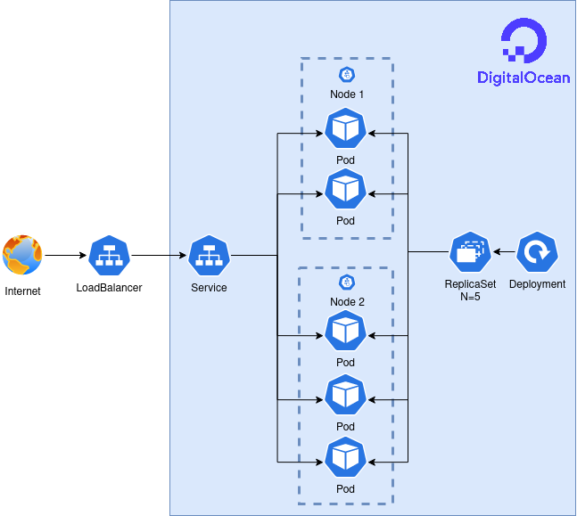

<h1 id="inicio" align="center">
   
  
   
</h1>

A jornada DevOps de elite aconteceu entre os dias 23 a 27 de janeiro de 2023, evento realizado pelo [DevOps Pro](https://www.devopspro.com.br/) e abordou as seguintes tecnologias:

## 💻 Tecnologias abordadas

<table>
  <tbody>
    <tr>
      <td align="center">Aula 1 (23/01) 
        &nbsp;&nbsp;&nbsp;&nbsp;&nbsp;
      </td>
      <td align="center">Aula 2 (24/01) 
        &nbsp;&nbsp;&nbsp;&nbsp;&nbsp;
      </td>
      <td align="center">Aula 3 (25/01) 
        &nbsp;&nbsp;&nbsp;&nbsp;&nbsp;
      </td>
      <td align="center">Aula 4 (26/01) 
        &nbsp;&nbsp;&nbsp;&nbsp;&nbsp;
      </td>
      <td align="center">Aula 5 (27/01) 
        &nbsp;&nbsp;&nbsp;&nbsp;&nbsp;
      </td>
    </tr>
    <tr>
        <td> </td>
        <td></td>
        <td></td>
        <td></td>
        <td>
         </td>
    </tr>
  </tbody>
</table>

## 🚀 Lista de conteúdos das aulas

### 1. [Docker](https://github.com/taffarel55/jornada-devops-elite/tree/main/aula1)
- [Comandos básicos Docker](https://github.com/taffarel55/jornada-devops-elite/tree/main/aula1#comandos-b%C3%A1sicos-docker)
- [Criação de imagens](https://github.com/taffarel55/jornada-devops-elite/tree/main/aula1#cria%C3%A7%C3%A3o-de-imagens)
- [Subindo uma imagem para o Dockerhub](https://github.com/taffarel55/jornada-devops-elite/tree/main/aula1#subindo-uma-imagem-para-o-dockerhub)
- [Construindo uma aplicação Node.js e subindo no Docker Hub](https://github.com/taffarel55/jornada-devops-elite/tree/main/aula1#construindo-uma-aplica%C3%A7%C3%A3o-nodejs-e-subindo-no-docker-hub)
### 2. [Kubernetes](https://github.com/taffarel55/jornada-devops-elite/tree/main/aula2)
- [Estrutura do Kubernetes](https://github.com/taffarel55/jornada-devops-elite/tree/main/aula2#estrutura-do-kubernetes)
- [Criando um Cluster](https://github.com/taffarel55/jornada-devops-elite/tree/main/aula2#criando-um-cluster)
- [Compreendendo os elementos básico dos Kubernetes](https://github.com/taffarel55/jornada-devops-elite/tree/main/aula2#compreendendo-os-elementos-b%C3%A1sico-dos-kubernetes)
- [Subindo uma aplicação kube-dev](https://github.com/taffarel55/jornada-devops-elite/tree/main/aula2#subindo-uma-aplica%C3%A7%C3%A3o)
### 3. [Terraform](https://github.com/taffarel55/jornada-devops-elite/tree/main/aula3)
- [Introdução ao Terraform](https://github.com/taffarel55/jornada-devops-elite/tree/main/aula3#introdu%C3%A7%C3%A3o-ao-terraform)
- [Criando serviços na Digital Ocean](https://github.com/taffarel55/jornada-devops-elite/tree/main/aula3#digital-ocean)
- [Criando serviços através do Terraform](https://github.com/taffarel55/jornada-devops-elite/tree/main/aula3#terraform)
### 4. [Jenkins](https://github.com/taffarel55/jornada-devops-elite/tree/main/aula4)
- [Pipeline CI e CD](https://github.com/taffarel55/jornada-devops-elite/tree/main/aula4#pipeline-ci-e-cd)
- [Definição do projeto e configuração das máquinas](https://github.com/taffarel55/jornada-devops-elite/tree/main/aula4#projeto)
- [Criando pipeline no Jenkins](https://github.com/taffarel55/jornada-devops-elite/tree/main/aula4#criando-o-pipeline-no-jenkins)
### 5. [Prometheus e Grafana](https://github.com/taffarel55/jornada-devops-elite/tree/main/aula5)
- [Introdução sobre métricas](https://github.com/taffarel55/jornada-devops-elite/tree/main/aula5#introdu%C3%A7%C3%A3o-sobre-m%C3%A9tricas)
- [Apresentando o Prometheus](https://github.com/taffarel55/jornada-devops-elite/tree/main/aula5#apresentando-o-prometheus)
- [Subindo serviços de monitoramento no Kubernetes](https://github.com/taffarel55/jornada-devops-elite/tree/main/aula5#subindo-servi%C3%A7os-de-monitoramento-no-kubernetes)
- [Investigando os serviços de monitoramento](https://github.com/taffarel55/jornada-devops-elite/tree/main/aula5#investigando-os-servi%C3%A7os-de-monitoramento)

> Algumas imagens do repositório foram obtidas diretamente das aulas do curso Jornada DevOps de Elite oferecido pelo [DevOps Pro](https://www.devopspro.com.br/).
> Códigos fontes foram usados a partir do github do [KubeDev](https://github.com/KubeDev)

<h2 id="topologia">🤯 Topologia da aplicação</h2>

---

<h2 id="contribuir">📫 Contribuindo para este repositório</h2>

Contribuições são o que tornam a comunidade de código aberto um lugar incrível para aprender, inspirar e criar. Todas as contribuições que você fizer são muito bem vindas!

Se quiser "fortalecer" aí sugerindo correções de texto e ortografia ou algum ajuste de código, pode abrir o pull request que vou amar!! :heart_eyes:

> Se tiver uma contribuição rápida que não envolve código, conteúdo ou quiser reportar algum problema sem ter que propor mudanças [clique aqui](https://github.com/taffarel55/jornada-devops-elite/issues/new) para criar uma issue.

### Caso contrário, siga estes passos

1. Bifurque este repositório.
2. Crie um branch: `git checkout -b camadasDocker`.
3. Adicione suas edições para próximo commit: `git add .`
4. Faça suas alterações e confirme-as: `git commit -m 'Correção sobre camadas Docker'`
5. Especifique um novo repositório upstream remote que será sincronizado com a bifurcação: `git remote add upstream git@github.com:taffarel55/jornada-devops-elite.git`
6. Envie para o branch original: `git push --set-upstream origin camadasDocker`
7. Crie a solicitação de pull através do link que aparecer no terminal.

### Muito complicado tudo que ta aí em cima?

Como alternativa do procedimento anterior, veja o passo a passo com imagens e explicações mais detalhadas de como propor mudanças:

1. [Como bifurcar e clonar um repositório Github](https://docs.github.com/pt/github/getting-started-with-github/quickstart/fork-a-repo)
2. [Como criar uma bifurcação para propor mudanças](https://docs.github.com/pt/pull-requests/collaborating-with-pull-requests/proposing-changes-to-your-work-with-pull-requests/creating-and-deleting-branches-within-your-repository)
3. [Como propor de mudança através de uma bifurcação](https://docs.github.com/pt/github/collaborating-with-pull-requests/proposing-changes-to-your-work-with-pull-requests/creating-a-pull-request-from-a-fork)

## 🤝 Pessoas colaboradoras

Agradecemos às seguintes pessoas que contribuíram para este projeto:

<table>
  <tr>
    <td align="center">
      <a href="https://github.com/taffarel55">
         
        
          <b>Maurício Taffarel</b>
        
      </a>
    </td>
    <!--
    <td align="center">
      <a href="#">
         
        
          <b>Mark Zuckerberg</b>
        
      </a>
    </td>
    <td align="center">
      <a href="#">
         
        
          <b>Steve Jobs</b>
        
      </a>
    </td>
    -->
  </tr>
</table>

## 😄 Seja um das pessoas contribuidoras 

Quer fazer parte desse projeto e ajustar alguma ~~merda~~ besteira que eu escrevi? Proponha mudanças seguindo este [passo a passo](#contribuir). Fazer

Ah, fique a vontade para editar este `README.md` te adicionando à lista de pessoas contribuidoras.

## 📝 Licença

<!-- Esse projeto está sob licença. Veja o arquivo [LICENÇA](LICENSE) para mais detalhes. -->

Os conteúdos deste repositório foram exclusivamente utilizados da semana DevOps de Elite realizado pelo [DevOps Pro](https://www.devopspro.com.br/) e eu solicitei uma permissão para ester repo. :heart:

[⬆ Voltar ao topo](#inicio) 
