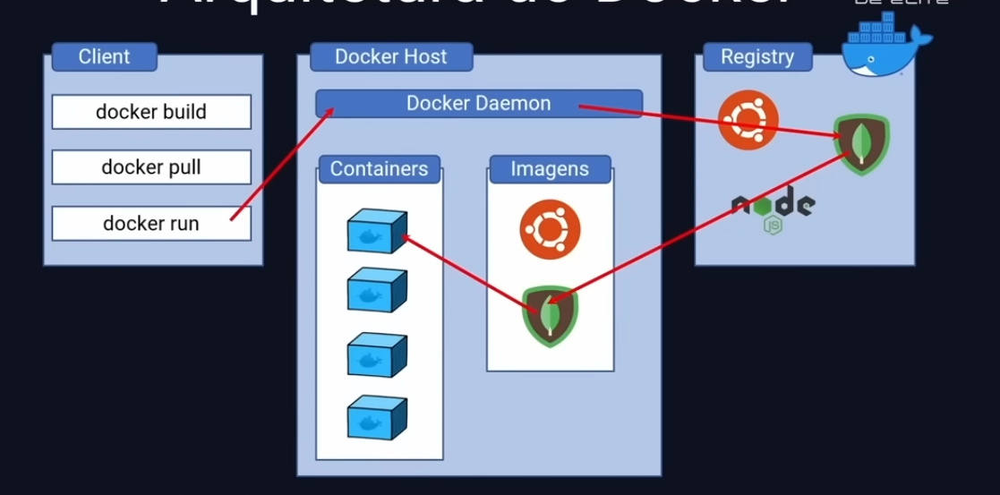
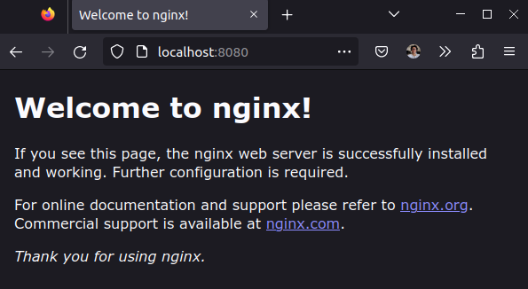
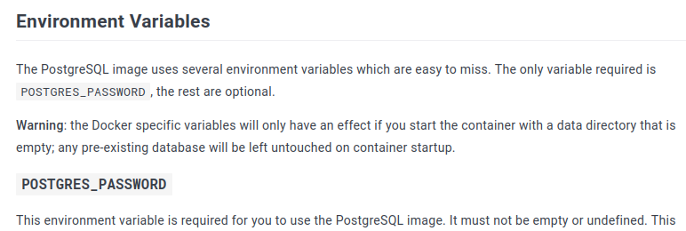
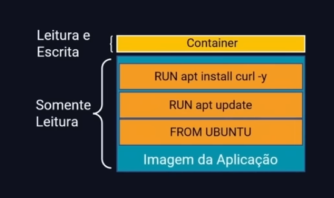
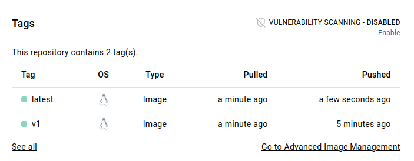
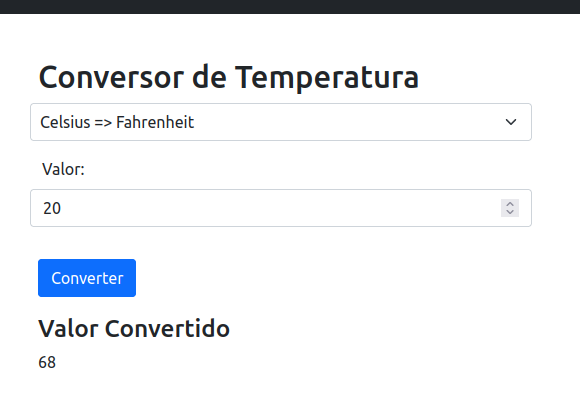

# Comandos básicos Docker

## `docker run hello-world`

> Primeiramente o cliente Docker tenta executar se comunica com o `Docker Daemon`, que neste caso está na mesma máquina que o cliente e solicita a criação de um _container_ usando a _imagem_ `hello-world`. A imagem não foi encontrada localmente, o `Docker Daemon` então foi no `Registry`, baixou a imagem para ser criar o container a partir desta imagem.



A saída do comando resultou em:

```bash
docker run hello-world
Unable to find image 'hello-world:latest' locally
latest: Pulling from library/hello-world
2db29710123e: Pull complete
Digest: sha256:aa0cc8055b82dc2509bed2e19b275c8f463506616377219d9642221ab53cf9fe
Status: Downloaded newer image for hello-world:latest

Hello from Docker!
This message shows that your installation appears to be working correctly.

To generate this message, Docker took the following steps:
 1. The Docker client contacted the Docker daemon.
 2. The Docker daemon pulled the "hello-world" image from the Docker Hub.
    (amd64)
 3. The Docker daemon created a new container from that image which runs the
    executable that produces the output you are currently reading.
 4. The Docker daemon streamed that output to the Docker client, which sent it
    to your terminal.

To try something more ambitious, you can run an Ubuntu container with:
 $ docker run -it ubuntu bash

Share images, automate workflows, and more with a free Docker ID:
 https://hub.docker.com/

For more examples and ideas, visit:
 https://docs.docker.com/get-started/
```

## `docker container ls -a`

> Lista os containers com alguns dados em realação aos conteiners existentes, o parâmetro `-a` permite mostrar os containers que não estão listados

Usos:

```bash
❯ docker container ls
CONTAINER ID   IMAGE     COMMAND   CREATED   STATUS    PORTS     NAMES
```

```bash
❯ docker container ls -a
CONTAINER ID   IMAGE         COMMAND    CREATED          STATUS                      PORTS     NAMES
d9c869a1c9f4   hello-world   "/hello"   32 seconds ago   Exited (0) 31 seconds ago             heuristic_mclaren
```

O nome do container foi dado de forma aleatória, mas esse nome também pode ser dado com o comando:

## `docker container run --name meucontainer hello-world`

> Este comando possibilita a criação de um container e dar um nome para ele com o parâmetro `--name`.
> Após a execução do comando em questão, podemos ver todos os containers e verificar que o nome foi realmente dado:

```bash
❯ docker container ls -a
CONTAINER ID   IMAGE         COMMAND    CREATED          STATUS                      PORTS     NAMES
222b96e6196a   hello-world   "/hello"   47 seconds ago   Exited (0) 46 seconds ago             meucontainer
d9c869a1c9f4   hello-world   "/hello"   3 minutes ago    Exited (0) 3 minutes ago              heuristic_mclaren
```

## docker container run --rm hello-world

> Após executar um container, faz sua auto exclusão.

```bash
❯ docker container ls -a
CONTAINER ID   IMAGE         COMMAND    CREATED         STATUS                     PORTS     NAMES
222b96e6196a   hello-world   "/hello"   3 minutes ago   Exited (0) 3 minutes ago             meucontainer
d9c869a1c9f4   hello-world   "/hello"   6 minutes ago   Exited (0) 6 minutes ago             heuristic_mclaren
```

## `docker container rm <id/nome>`

> Remove um container a partir do seu `id` ou `nome`.

```bash
❯ docker container rm d9c869a1c9f4
d9c869a1c9f4
❯ docker container ls -a
CONTAINER ID   IMAGE         COMMAND    CREATED         STATUS                     PORTS     NAMES
222b96e6196a   hello-world   "/hello"   6 minutes ago   Exited (0) 6 minutes ago             meucontainer
❯ docker container rm meucontainer
meucontainer
❯ docker container ls -a
CONTAINER ID   IMAGE     COMMAND   CREATED   STATUS    PORTS     NAMES
```

## `docker container run -it ubuntu /bin/bash`

- `docker container run`: Executa um container
- `-it`: Modo interativo habilitando o terminal
- `ubuntu`: Imagem usada
- `/bin/bash`: Caminho para usar o _bash_

```bash
❯ docker container run -it ubuntu /bin/bash
Unable to find image 'ubuntu:latest' locally
latest: Pulling from library/ubuntu
6e3729cf69e0: Pull complete
Digest: sha256:27cb6e6ccef575a4698b66f5de06c7ecd61589132d5a91d098f7f3f9285415a9
Status: Downloaded newer image for ubuntu:latest
root@90a637ef61b3:/# ls
bin  boot  dev  etc  home  lib  lib32  lib64  libx32  media  mnt  opt  proc  root  run  sbin  srv  sys  tmp  usr  var
root@90a637ef61b3:/# uname -a
Linux 90a637ef61b3 5.15.0-58-generic #64~20.04.1-Ubuntu SMP Fri Jan 6 16:42:31 UTC 2023 x86_64 x86_64 x86_64 GNU/Linux
root@90a637ef61b3:/#
```

## `docker container run -d nginx`

> Executa um container em modo --detach, roda no background e exibe o seu ID

```bash
❯ docker container run -d nginx

Unable to find image 'nginx:latest' locally
latest: Pulling from library/nginx
8740c948ffd4: Pull complete
d2c0556a17c5: Pull complete
c8b9881f2c6a: Pull complete
693c3ffa8f43: Pull complete
8316c5e80e6d: Pull complete
b2fe3577faa4: Pull complete
Digest: sha256:b8f2383a95879e1ae064940d9a200f67a6c79e710ed82ac42263397367e7cc4e
Status: Downloaded newer image for nginx:latest
7bb2980a0be5afe23633a9b3ebf6259dcb26647516ac6049b4dbc1a832da8596
```

## `docker container exec -it <id> /bin/bash`

> Executa um comando em um container já em execução

```bash
❯ docker ps
CONTAINER ID   IMAGE     COMMAND                  CREATED          STATUS          PORTS     NAMES
7bb2980a0be5   nginx     "/docker-entrypoint.…"   12 minutes ago   Up 12 minutes   80/tcp    thirsty_robinson
90a637ef61b3   ubuntu    "/bin/bash"              20 minutes ago   Up 20 minutes             romantic_shirley
❯ docker container exec -it 7bb2980a0be5 /bin/bash
root@7bb2980a0be5:/# curl -I http://localhost
HTTP/1.1 200 OK
Server: nginx/1.23.3
Date: Thu, 26 Jan 2023 00:13:45 GMT
Content-Type: text/html
Content-Length: 615
Last-Modified: Tue, 13 Dec 2022 15:53:53 GMT
Connection: keep-alive
ETag: "6398a011-267"
Accept-Ranges: bytes
```

## `docker container run -p <portaLocal>:<portaContainer>`

> Vincular uma porta local do host com uma porta do container. (port bind)

```bash
❯ docker container run -dp 8080:80 nginx
29e5808465db934e19d3955542f44bdd722f20f6b8395b97596411e530013a7e
❯ docker container ls
CONTAINER ID   IMAGE     COMMAND                  CREATED          STATUS          PORTS                                   NAMES
29e5808465db   nginx     "/docker-entrypoint.…"   5 seconds ago    Up 4 seconds    0.0.0.0:8080->80/tcp, :::8080->80/tcp   lucid_fermat
7bb2980a0be5   nginx     "/docker-entrypoint.…"   18 minutes ago   Up 18 minutes   80/tcp                                  thirsty_robinson
90a637ef61b3   ubuntu    "/bin/bash"              25 minutes ago   Up 25 minutes                                           romantic_shirley
```



## `docker container run -dp 5432:5432 -e POSTGRES_PASSWORD=Pg@123 -e POSTGRES_USER=kubenews -e POSTGRES_DB=kubenews postgres`

> Cria um container com variáveis de ambiente, neste exemplo é uma aplicação de um banco de dados.

Para saber quais variáveis de ambiente a imagem `postgres` aceita, basta olhar a documentação:


> Documentação pode ser encontrada [aqui](https://hub.docker.com/_/postgres)

---

# Criação de imagens

> Criando uma imagem a partir de uma imagem do ubuntu, mas com o curl instalado.

```Dockerfile
# current directory: jornada-devops-elite/aula1/ubuntu-curl
FROM ubuntu
RUN apt update
RUN apt install curl -y
```

`docker build -t ubuntu-curl .`

```bash
❯ cd ubuntu-curl
❯ docker build -t ubuntu-curl .
Sending build context to Docker daemon  2.048kB
Step 1/3 : FROM ubuntu
 ---> 6b7dfa7e8fdb
Step 2/3 : RUN apt update
 ---> Running in 9f6d4a2d6dbf
Removing intermediate container 9f6d4a2d6dbf
 ---> 0d357be396e8
Step 3/3 : RUN apt install curl -y
 ---> Running in f7d0661bda1e
Removing intermediate container f7d0661bda1e
 ---> 7cd086288529
Successfully built 7cd086288529
Successfully tagged ubuntu-curl:latest
```

A imagem é construída em camadas que são "empilhadas" a partir de cada comando do Dockerfile, além disso essa imagem final é somente leitura. 


O container cria uma camada a mais que possibilita a leitura e escrita a partir de uma imagem:



Para evitar ter muitas camadas diferentes, agrupa-se os dois comandos

```bash
FROM ubuntu
RUN apt update && apt install curl -y
```

---

# Subindo uma imagem para o Dockerhub

Criando imagem com uma tag com meu nome de usuário:
```bash
❯ docker build -t taffarel55/ubuntu-curl:v1 .
Step 1/2 : FROM ubuntu
 ---> 6b7dfa7e8fdb
Step 2/2 : RUN apt update && apt install curl -y
 ---> Running in dffc49ea2f58
Removing intermediate container dffc49ea2f58
 ---> 7e35f546d307
Successfully built 7e35f546d307
Successfully tagged taffarel55/ubuntu-curl:v1
❯ docker image ls
REPOSITORY               TAG       IMAGE ID       CREATED          SIZE
taffarel55/ubuntu-curl   v1        7e35f546d307   7 seconds ago    126MB
ubuntu-curl              latest    7cd086288529   53 minutes ago   126MB
postgres                 latest    9f3ec01f884d   2 weeks ago      379MB
ubuntu                   latest    6b7dfa7e8fdb   6 weeks ago      77.8MB
```

Logando no Dockerhub e subindo imagem
```bash
docker login
docker push
❯ docker push taffarel55/ubuntu-curl:v1
The push refers to repository [docker.io/taffarel55/ubuntu-curl]
e06717c76c2e: Pushed 
6515074984c6: Mounted from library/ubuntu 
v1: digest: sha256:01457307e25264770aa3c33b4418c0488a9776f923e547a1fd6a4f8ffd2423fe size: 741
```

É uma boa prática subir a imagem também com a tag latest. Para isso, podemos criar um novo nome para imagem e então subir:

```bash
❯ docker tag taffarel55/ubuntu-curl:v1 taffarel55/ubuntu-curl:latest
❯ docker image ls
REPOSITORY               TAG       IMAGE ID       CREATED          SIZE
taffarel55/ubuntu-curl   latest    7e35f546d307   5 minutes ago    126MB
taffarel55/ubuntu-curl   v1        7e35f546d307   5 minutes ago    126MB
ubuntu-curl              latest    7cd086288529   58 minutes ago   126MB
postgres                 latest    9f3ec01f884d   2 weeks ago      379MB
ubuntu                   latest    6b7dfa7e8fdb   6 weeks ago      77.8MB
❯ docker push taffarel55/ubuntu-curl
Using default tag: latest
The push refers to repository [docker.io/taffarel55/ubuntu-curl]
e06717c76c2e: Layer already exists 
6515074984c6: Layer already exists 
latest: digest: sha256:01457307e25264770aa3c33b4418c0488a9776f923e547a1fd6a4f8ffd2423fe size: 741
```

E as images foram para o Docker hub


---

# Construindo uma aplicação Node.js e subindo no Docker Hub

O arquivo `Dockerfile` foi construindo na pasta `./conversao-temperatura/src`

Após realizar o build da imagem, temos:
```bash
❯ cd src
❯ docker build -t taffarel55/conversao-temperatura:v1 .
Sending build context to Docker daemon    126kB
Step 1/7 : FROM node:18.11.0
 ---> a56fabe03ac9
Step 2/7 : WORKDIR /usr/src/app
 ---> Using cache
 ---> 12b99e0008d3
Step 3/7 : COPY package*.json ./
 ---> Using cache
 ---> 2fcfbc10c7f8
Step 4/7 : RUN npm install
 ---> Running in 01155560437f

added 153 packages, and audited 154 packages in 3s

26 packages are looking for funding
  run `npm fund` for details

1 high severity vulnerability

To address all issues, run:
  npm audit fix

Run `npm audit` for details.
npm notice 
npm notice New major version of npm available! 8.19.2 -> 9.4.0
npm notice Changelog: <https://github.com/npm/cli/releases/tag/v9.4.0>
npm notice Run `npm install -g npm@9.4.0` to update!
npm notice 
Removing intermediate container 01155560437f
 ---> cd32e27ebd61
Step 5/7 : COPY . .
 ---> f3d8fdca3d30
Step 6/7 : EXPOSE 8080
 ---> Running in c21a318f65d7
Removing intermediate container c21a318f65d7
 ---> 199d1986c1f4
Step 7/7 : CMD ["node", "server.js"]
 ---> Running in 5b5dd3405984
Removing intermediate container 5b5dd3405984
 ---> b4cd9bce7d60
Successfully built b4cd9bce7d60
Successfully tagged taffarel55/conversao-temperatura:v1
❯ docker image ls
REPOSITORY                         TAG       IMAGE ID       CREATED              SIZE
taffarel55/conversao-temperatura   v1        b4cd9bce7d60   56 seconds ago       1.02GB
```

E então, para subir as duas imagens:

```bash
❯ docker tag taffarel55/conversao-temperatura:v1 taffarel55/conversao-temperatura
❯ docker push taffarel55/conversao-temperatura:v1
The push refers to repository [docker.io/taffarel55/conversao-temperatura]
68b3922d9b3a: Preparing 
d30d980859f6: Preparing 
909b8ea57bc4: Preparing 
d30d980859f6: Pushed 
8b745df9e384: Mounted from library/node 
b452b4e9e6cd: Mounted from library/node 
99a0d589b696: Mounted from library/node 
f1479df99400: Mounted from library/node 
882fd36bfd35: Mounted from library/node 
d1dec9917839: Mounted from library/node 
d38adf39e1dd: Mounted from library/node 
4ed121b04368: Mounted from library/node 
d9d07d703dd5: Mounted from library/node 
v1: digest: sha256:e8de3474d66d0f4d0e532a99b886c40d6f4417387921f95eef3bc965f2225a11 size: 3052
❯ docker push taffarel55/conversao-temperatura
Using default tag: latest
The push refers to repository [docker.io/taffarel55/conversao-temperatura]
68b3922d9b3a: Preparing 
d30d980859f6: Preparing 
909b8ea57bc4: Preparing 
68b3922d9b3a: Layer already exists 
8b745df9e384: Layer already exists 
b452b4e9e6cd: Layer already exists 
99a0d589b696: Layer already exists 
f1479df99400: Layer already exists 
882fd36bfd35: Layer already exists 
d1dec9917839: Layer already exists 
d38adf39e1dd: Layer already exists 
4ed121b04368: Layer already exists 
d9d07d703dd5: Layer already exists 
latest: digest: sha256:e8de3474d66d0f4d0e532a99b886c40d6f4417387921f95eef3bc965f2225a11 size: 3052
```

E para executar a aplicação na máquina:
```bash
❯ docker run -d -p 8080:8080 taffarel55/conversao-temperatura
f07aa94cc17e7ff31a30a8f5290d3364fb2e654ab536640cd8dc761a2b91dd6f
```

