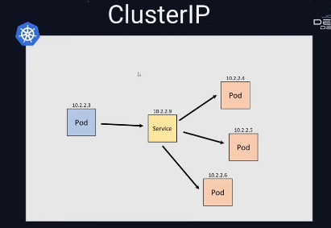
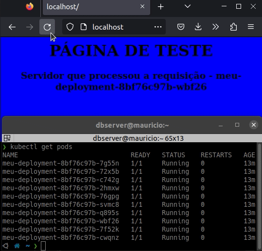
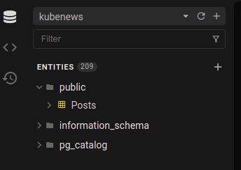

# Aula 2

## Estrutura do Kubernetes

> A arquitetura do Kubernetes é formado por um cluster, um conjunto de máquinas e elas vão cumprir um destes papeis:

- Kubernetes Control Plane (Master)
- Kubernetes Nodes


Os **Nodes** vão ser responsáveis por executar os containeres das aplicações enquanto o **Control Plane** vai gerenciar os **Nodes** e orquestrar o cluster. É necessário mais de um **Control Plane** no _Cluster_ porque se um tiver algum problema, o outro assume o papel e dessa forma é garantido a disponibilidade.

### Control Plane


- Kube Api Server: Responsável por receber a comunicação com o cluster (como por exemplo através pelo `kubectl`)
- ETCD: Banco de chave valor que armazena os dados do Kubernetes, mas para acessar eses valores é através do Kube Api Server
- Kube Scheduler: Componente que determina onde cada container vai ser executado no cluster
- Kube Controller Manager: Executa e gerencia todos os controladores do Kubernetes

### Node


- Kube Proxy: Responsável pelas comunicações de rede com o cluster
- Kubelet: Garante a execução dos containeres e interage com o Kube Api Server

---

## Criando um cluster

Criando:

```bash
❯ k3d cluster create
INFO[0031] Cluster 'k3s-default' created successfully!
INFO[0031] You can now use it like this:
kubectl cluster-info
```

Exectando inofmrção sobre o cluster

```
❯ kubectl cluster-info
Kubernetes control plane is running at https://0.0.0.0:35909
CoreDNS is running at https://0.0.0.0:35909/api/v1/namespaces/kube-system/services/kube-dns:dns/proxy
Metrics-server is running at https://0.0.0.0:35909/api/v1/namespaces/kube-system/services/https:metrics-server:https/proxy

To further debug and diagnose cluster problems, use 'kubectl cluster-info dump'.
```

Obtendo nodes

```bash
❯ kubectl get nodes
NAME                       STATUS   ROLES                  AGE     VERSION
k3d-k3s-default-server-0   Ready    control-plane,master   2m49s   v1.24.4+k3s1
```

Deletando cluster

```bash
❯ k3d cluster delete
INFO[0000] No clusters found
❯ k3d cluster list
NAME   SERVERS   AGENTS   LOADBALANCER
```

Criando o cluster sem o load balancer:

```bash
❯ k3d cluster create --no-lb
...
INFO[0011] Cluster 'k3s-default' created successfully!
INFO[0011] You can now use it like this:
kubectl cluster-info
```

```bash
❯ docker container ls
CONTAINER ID   IMAGE                      COMMAND                  CREATED         STATUS         PORTS                     NAMES
cacf58058bf9   rancher/k3s:v1.24.4-k3s1   "/bin/k3s server --t…"   3 minutes ago   Up 3 minutes   0.0.0.0:44421->6443/tcp   k3d-k3s-default-server-0

❯ k3d cluster list
NAME          SERVERS   AGENTS   LOADBALANCER
k3s-default   1/1       0/0      false
```

```
❯ k3d cluster create meucluster --servers 3 --agents 3
...

❯ kubectl get nodes
NAME                      STATUS   ROLES                       AGE   VERSION
k3d-meucluster-agent-0    Ready    <none>                      52s   v1.24.4+k3s1
k3d-meucluster-agent-1    Ready    <none>                      51s   v1.24.4+k3s1
k3d-meucluster-agent-2    Ready    <none>                      51s   v1.24.4+k3s1
k3d-meucluster-server-0   Ready    control-plane,etcd,master   98s   v1.24.4+k3s1
k3d-meucluster-server-1   Ready    control-plane,etcd,master   83s   v1.24.4+k3s1
k3d-meucluster-server-2   Ready    control-plane,etcd,master   58s   v1.24.4+k3s1

❯ k3d cluster list
NAME         SERVERS   AGENTS   LOADBALANCER
meucluster   3/3       3/3      true

❯ k3d cluster delete meucluster
...
INFO[0005] Successfully deleted cluster meucluster!
```

Criando cluster para usar na aula:

```bash
❯ k3d cluster create meucluster
```

## Compreendendo os elementos básico dos Kubernetes

### Pod

O menor elemento do Kubernetes, é nele que executamos os containers e o IP e o filesystem são compartilhados.

<center>


</center>

> Na hora de escalar uma aplicação, os pods são replicados, então não se deve colocar vários serviços diferentes dentro de um Pod

### Criando um Pod

É preciso criar um arquivo de manifesto, o seguinte arquivo é o `files/pod.yaml`.

Para saber qual é o `apiVersion` para se criar um **Pod**, consulta-se através do comando `kubectl api-resources`

Arquivo `pod.yaml`:

```yaml
apiVersion: v1
kind: Pod
metadata:
  name: meu-pod
spec:
  containers:
    - name: site-container
      image: fabricioveronez/web-page:blue
      ports:
        - containerPort: 80
      resources:
        limits:
          memory: 512Mi
          cpu: "1"
        requests:
          memory: 256Mi
          cpu: "0.2"
```

```bash
❯ kubectl apply -f pod.yaml
pod/meu-pod created

❯ kubectl get pods
NAME      READY   STATUS    RESTARTS   AGE
meu-pod   1/1     Running   0          45s

❯ kubectl get pods -o wide
NAME      READY   STATUS    RESTARTS   AGE   IP          NODE                      NOMINATED NODE   READINESS GATES
meu-pod   1/1     Running   0          48s   10.42.0.9   k3d-meucluster-server-0   <none>           <none>
```

Executando este pod:

```bash
❯ kubectl port-forward pod/meu-pod 8080:80
Forwarding from 127.0.0.1:8080 -> 80
Forwarding from [::1]:8080 -> 80
Handling connection for 8080
Handling connection for 8080
```


Quando eu deleto um pod:
```bash
❯ kubectl delete pod meu-pod
pod "meu-pod" deleted
❯ kubectl get pods
No resources found in default namespace.
```

Um pod executa um container, ele não realiza o gerenciamento. Esse cara é um ReplicaSet.

Para os objetos se interagirem, temos o `label` e o `selector`

A partir daqui estou usando o arquivo `pod2.yaml`. Inicialmente o arquivo está como mostrado a seguir:

```yaml
apiVersion: v1
kind: Pod
metadata:
  name: meupod-azul
  labels:
    cor: azul
spec:
  containers:
    - name: site-container
      image: fabricioveronez/web-page:blue
      ports:
        - containerPort: 80
      resources:
        limits:
          memory: 512Mi
          cpu: "1"
        requests:
          memory: 256Mi
          cpu: "0.2"
---
apiVersion: v1
kind: Pod
metadata:
  name: meupod-verde
  labels:
    cor: verde
spec:
  containers:
    - name: site-container
      image: fabricioveronez/web-page:blue
      ports:
        - containerPort: 80
      resources:
        limits:
          memory: 512Mi
          cpu: "1"
        requests:
          memory: 256Mi
          cpu: "0.2"
```

```bash
❯ kubectl apply -f pod2.yaml
pod/meupod-azul created
pod/meupod-verde created
❯ kubectl get pods
NAME           READY   STATUS    RESTARTS   AGE
meupod-verde   1/1     Running   0          8s
meupod-azul    1/1     Running   0          8s
```

Para filtrar por um label, utiliza-se o seguinte comando:

```bash
❯ kubectl get pods -l cor=azul
NAME          READY   STATUS    RESTARTS   AGE
meupod-azul   1/1     Running   0          55s
❯ kubectl get pods -l cor=verde
NAME           READY   STATUS    RESTARTS   AGE
meupod-verde   1/1     Running   0          61s
```

### ReplicaSet

Ele vai ser um controlador no Kubernetes responsável por garantir que a quantidade de réplicas desejadas de um Pod vai ser igual a quantidade de réplicas que estão sendo executadas.


> No exemplo acima tem 3 réplicas criadas, se por algum motivo um Pod cair, o ReplicaSet vai ver isso e vai subir um novo Pod por que o número de Pods desejados são 3. O mesmo ocorre para caso a quantidade de Pods aumentem.

#### Usando o ReplicaSet

Primeiro deleta-se os dois criados antes:

```bash
❯ kubectl get pods
NAME           READY   STATUS    RESTARTS   AGE
meupod-verde   1/1     Running   0          5m15s
meupod-azul    1/1     Running   0          5m15s

❯ kubectl delete -f pod2.yaml
pod "meupod-azul" deleted
pod "meupod-verde" deleted

❯ kubectl get pods
No resources found in default namespace.
```

Agora o `replicaset.yaml` inicialmente foi criado desta maneira:

```bash
apiVersion: apps/v1
kind: ReplicaSet
metadata:
  name: meu-replicaset
spec:
  selector: 
    matchLabels:
      app: web
  template:
    metadata:
      labels:
        app: web
    spec:
      containers:
        - name: site-container
          image: fabricioveronez/web-page:blue
          ports:
            - containerPort: 80
          resources:
            limits:
              memory: 512Mi
              cpu: "1"
            requests:
              memory: 256Mi
              cpu: "0.2"
```

E após o apply:

```bash
❯ kubectl get pods
NAME                   READY   STATUS    RESTARTS   AGE
meu-replicaset-56ssl   1/1     Running   0          10m

❯ kubectl get replicaset
NAME             DESIRED   CURRENT   READY   AGE
meu-replicaset   1         1         1       10m
```

Agora vamos colocar 5 réplicas para ver se ele funciona.

```
spec:
  replicas: 5
```

```bash
❯ kubectl apply -f replicaset.yaml
replicaset.apps/meu-replicaset configured
❯ kubectl get pods
NAME                   READY   STATUS    RESTARTS   AGE
meu-replicaset-56ssl   1/1     Running   0          11m
meu-replicaset-9hvgr   1/1     Running   0          11s
meu-replicaset-jrz29   1/1     Running   0          11s
meu-replicaset-47c7m   1/1     Running   0          11s
meu-replicaset-mpmxt   1/1     Running   0          11s
❯ kubectl describe replicaset meu-replicaset
Name:         meu-replicaset
Namespace:    default
Selector:     app=web
Labels:       <none>
Annotations:  <none>
Replicas:     5 current / 5 desired
Pods Status:  5 Running / 0 Waiting / 0 Succeeded / 0 Failed
```

Vamos deletar um Pod manualmente agora para ver se o ReplicaSet vai levantar outro.

```
❯ kubectl get pods
NAME                   READY   STATUS    RESTARTS   AGE
meu-replicaset-56ssl   1/1     Running   0          19m
meu-replicaset-9hvgr   1/1     Running   0          8m18s
meu-replicaset-jrz29   1/1     Running   0          8m18s
meu-replicaset-47c7m   1/1     Running   0          8m18s
meu-replicaset-mpmxt   1/1     Running   0          8m18s

❯ kubectl delete pod meu-replicaset-56ssl
pod "meu-replicaset-56ssl" deleted

❯ kubectl get pods
NAME                   READY   STATUS    RESTARTS   AGE
meu-replicaset-9hvgr   1/1     Running   0          8m39s
meu-replicaset-jrz29   1/1     Running   0          8m39s
meu-replicaset-47c7m   1/1     Running   0          8m39s
meu-replicaset-mpmxt   1/1     Running   0          8m39s
meu-replicaset-j5glm   1/1     Running   0          3s
```

Agora vamos mudar o ReplicaSet usando o apply e ver se isso vai mudar todos os 5 pods

Mudança no arquivo:
```
          image: fabricioveronez/web-page:green
```

```bash
❯ kubectl get pods
NAME                   READY   STATUS    RESTARTS   AGE
meu-replicaset-9hvgr   1/1     Running   0          14m
meu-replicaset-jrz29   1/1     Running   0          14m
meu-replicaset-47c7m   1/1     Running   0          14m
meu-replicaset-mpmxt   1/1     Running   0          14m
meu-replicaset-j5glm   1/1     Running   0          5m55s

❯ kubectl apply -f replicaset.yaml
replicaset.apps/meu-replicaset configured

❯ kubectl get pods
NAME                   READY   STATUS    RESTARTS   AGE
meu-replicaset-9hvgr   1/1     Running   0          15m
meu-replicaset-jrz29   1/1     Running   0          15m
meu-replicaset-47c7m   1/1     Running   0          15m
meu-replicaset-mpmxt   1/1     Running   0          15m
meu-replicaset-j5glm   1/1     Running   0          6m44s
```

Nota-se que todos os pods ainda são antigos, o ReplicaSet não tem essa capacidade de atualizar os pods.

Agora vou tentar deletar um manualmente pra ver se ele vai levantar um Pod com a nova imagem do template

```bash
❯ kubectl get pods
NAME                   READY   STATUS    RESTARTS   AGE
meu-replicaset-9hvgr   1/1     Running   0          16m
meu-replicaset-jrz29   1/1     Running   0          16m
meu-replicaset-47c7m   1/1     Running   0          16m
meu-replicaset-mpmxt   1/1     Running   0          16m
meu-replicaset-j5glm   1/1     Running   0          8m2s
❯ kubectl delete pod meu-replicaset-9hvgr
pod "meu-replicaset-9hvgr" deleted

❯ kubectl get pods
NAME                   READY   STATUS              RESTARTS   AGE
meu-replicaset-jrz29   1/1     Running             0          17m
meu-replicaset-47c7m   1/1     Running             0          17m
meu-replicaset-mpmxt   1/1     Running             0          17m
meu-replicaset-j5glm   1/1     Running             0          8m25s
meu-replicaset-4svth   0/1     ContainerCreating   0          4s

❯ kubectl get pods
NAME                   READY   STATUS    RESTARTS   AGE
meu-replicaset-jrz29   1/1     Running   0          17m
meu-replicaset-47c7m   1/1     Running   0          17m
meu-replicaset-mpmxt   1/1     Running   0          17m
meu-replicaset-j5glm   1/1     Running   0          8m34s
meu-replicaset-4svth   1/1     Running   0          13s
```

Com o `kubectl describe replicaset meu-replicaset-4svth` foi possível ver que o pod estava usando a imagem nova com webpage green.

Para fazer esse deploy eficiente, tem o controlador `Deployment`

Antes de ir pra ele, vamos deletar o ReplicaSet atual:

```bash
❯ kubectl delete -f replicaset.yaml
replicaset.apps "meu-replicaset" deleted
```

### Deployment 

O Deployment vai gerenciar as versões do ReplicaSet

<center>


</center>

Quando for alterado uma especificação, vai ser criado um novo ReplicaSet é criado com esta especificação e o antigo é mantido, mas os Pods não vão ser mais gerenciados por ele, aos poucos vão ser criados Pods no ReplicaSet mais novo

| 1 | 2 | 3 | 4 |
|:-:|:-:|:-:|:-:|
|  |  |  | 

Isso é feito dessa forma por que se essa nova imagem der problema, tem um ReplicaSet com o estado anterior pra trocar com eficiência caso dê problema.

Assim o arquivo `deployment.yaml` foi criado incialmente:

```yaml
apiVersion: apps/v1
kind: Deployment
metadata:
  name: meu-deployment
spec:
  replicas: 1
  selector: 
    matchLabels:
      app: web
  template:
    metadata:
      labels:
        app: web
    spec:
      containers:
        - name: site-container
          image: fabricioveronez/web-page:blue
          ports:
            - containerPort: 80
          resources:
            limits:
              memory: 512Mi
              cpu: "1"
            requests:
              memory: 256Mi
              cpu: "0.2"
```

> Nota-se que não precisa especificar um ReplicaSet, uma vez que isso é feito de maneira implícita.

Executando:

```bash
❯ kubectl apply -f deployment.yaml
deployment.apps/meu-deployment created

❯ kubectl get pods
NAME                             READY   STATUS    RESTARTS   AGE
meu-deployment-8bf76c97b-8gsjw   1/1     Running   0          12s

❯ kubectl get replicaset
NAME                       DESIRED   CURRENT   READY   AGE
meu-deployment-8bf76c97b   1         1         1       40s
```

> Observa-se que há um replicaset criado, e agora o nome do replicaset é concatenado com um id, já que a criação de replicasets se torna dinâmica através do deployment

Testando a escala, mudando para a quantidade de replicas pra 5, temos:

```yaml
spec:
  replicas: 5
```

```bash
❯ kubectl apply -f deployment.yaml
deployment.apps/meu-deployment configured

❯ kubectl get pods
NAME                             READY   STATUS    RESTARTS   AGE
meu-deployment-8bf76c97b-8gsjw   1/1     Running   0          3m49s
meu-deployment-8bf76c97b-4vgb6   1/1     Running   0          4s
meu-deployment-8bf76c97b-vh6d9   1/1     Running   0          4s
meu-deployment-8bf76c97b-lqp2h   1/1     Running   0          4s
meu-deployment-8bf76c97b-fr6x8   1/1     Running   0          4s
```

Agora mudando a image para green como foi feito antes:

```bash
❯ kubectl apply -f deployment.yaml
kdeployment.apps/meu-deployment configured

❯ kubectl get pods
NAME                              READY   STATUS              RESTARTS   AGE
meu-deployment-8bf76c97b-8gsjw    1/1     Running             0          5m36s
meu-deployment-69649c7657-sqqfs   1/1     Running             0          3s
meu-deployment-8bf76c97b-4vgb6    1/1     Terminating         0          111s
meu-deployment-69649c7657-97nxq   1/1     Running             0          3s
meu-deployment-8bf76c97b-fr6x8    1/1     Terminating         0          111s
meu-deployment-69649c7657-l5lxj   0/1     Pending             0          1s
meu-deployment-69649c7657-7n9ss   1/1     Running             0          3s
meu-deployment-8bf76c97b-vh6d9    1/1     Terminating         0          111s
meu-deployment-69649c7657-nk48k   0/1     ContainerCreating   0          2s

❯ kubectl get pods
NAME                              READY   STATUS    RESTARTS   AGE
meu-deployment-69649c7657-sqqfs   1/1     Running   0          11s
meu-deployment-69649c7657-97nxq   1/1     Running   0          11s
meu-deployment-69649c7657-7n9ss   1/1     Running   0          11s
meu-deployment-69649c7657-nk48k   1/1     Running   0          10s
meu-deployment-69649c7657-l5lxj   1/1     Running   0          9s
```

Todos os pods foram para outro replicaset
```bash
❯ kubectl get replicaset
NAME                        DESIRED   CURRENT   READY   AGE
meu-deployment-8bf76c97b    0         0         0       23m
meu-deployment-69649c7657   5         5         5       17m
```

Deu ruim?? vamos de rollback:

```bash
❯ kubectl rollout undo deployment meu-deployment
deployment.apps/meu-deployment rolled back

❯ kubectl get pods
NAME                             READY   STATUS    RESTARTS   AGE
meu-deployment-8bf76c97b-pxgtm   1/1     Running   0          11s
meu-deployment-8bf76c97b-wxvd9   1/1     Running   0          11s
meu-deployment-8bf76c97b-gmht2   1/1     Running   0          11s
meu-deployment-8bf76c97b-4z8k8   1/1     Running   0          9s
meu-deployment-8bf76c97b-hs25p   1/1     Running   0          9s

❯ kubectl get replicaset
NAME                        DESIRED   CURRENT   READY   AGE
meu-deployment-69649c7657   0         0         0       23m
meu-deployment-8bf76c97b    5         5         5       29m
```

Agora para expor os Pods, pois eu preciso de um ponto único de comunicação e fazer o balanceamento de carga.

### Service

O service é um elemento de comunicações entre os Pods, assim como elementos externos.


Existem diferentes tipos de service:

- ClusterIP
- NodePort
- LoadBalancer

#### ClusterIP

> O ClusterIP é um ponto de comunicação para comunicação interna entre Pods



#### NodePort

> O NodePort você consegue expor os serviços externamente através de um IP do seu cluster


#### LoadBalancer

> Cria um IP público para ser utilizado como acesso ao Service, dessa forma você vai consumir um serviço do seu provedor de nuvem


Para experimentar isso na prática, primeiro acrescenta-se ao arquivo `deployment.yaml` o seguinte trecho:

```yaml
---
apiVersion: v1
kind: Service
metadata:
  name: web-page
spec: 
  selector:
    app: web
  ports:
  - port: 80
    protocol: TCP
  type: NodePort
```

E isso é criado em `deployment2.yaml`

E após o apply:

```bash
❯ kubectl apply -f deployment2.yaml
deployment.apps/meu-deployment configured
service/web-page unchanged

❯ kubectl get services
NAME         TYPE        CLUSTER-IP    EXTERNAL-IP   PORT(S)        AGE
kubernetes   ClusterIP   10.43.0.1     <none>        443/TCP        3h12m
web-page     NodePort    10.43.95.42   <none>        80:32513/TCP   13m
```

Agora faremos um port forward diretamente no service:

```bash
❯ kubectl port-forward service/web-page 8080:80
Forwarding from 127.0.0.1:8080 -> 80
Forwarding from [::1]:8080 -> 80
```


Em um outro terminal:
```bash
❯ kubectl get pods
NAME                              READY   STATUS    RESTARTS   AGE
meu-deployment-69649c7657-pw6wg   1/1     Running   0          22m
meu-deployment-69649c7657-fflxh   1/1     Running   0          22m
meu-deployment-69649c7657-qqwfj   1/1     Running   0          22m
meu-deployment-69649c7657-4xlbz   1/1     Running   0          22m
meu-deployment-69649c7657-hxs22   1/1     Running   0          22m
```

Agora mudei o número de replicas para 10 e ainda no outro terminal com o primeiro rodando o port-forward e a imagem do template agora blue:

```bash
❯ kubectl apply -f deployment2.yaml
deployment.apps/meu-deployment configured
service/web-page unchanged
❯ kubectl get pods
NAME                              READY   STATUS              RESTARTS   AGE
meu-deployment-8bf76c97b-l6kjz    1/1     Running             0          20s
meu-deployment-8bf76c97b-ggpcn    1/1     Running             0          18s
meu-deployment-8bf76c97b-k68gr    1/1     Running             0          18s
meu-deployment-8bf76c97b-lktx5    1/1     Running             0          20s
meu-deployment-8bf76c97b-pxd4t    1/1     Running             0          20s
meu-deployment-8bf76c97b-222zw    0/1     Pending             0          8s
meu-deployment-8bf76c97b-xpx2h    1/1     Running             0          12s
meu-deployment-8bf76c97b-vv5jx    1/1     Running             0          11s
meu-deployment-8bf76c97b-zxrvt    0/1     ContainerCreating   0          10s
meu-deployment-8bf76c97b-hnslk    1/1     Running             0          9s
meu-deployment-69649c7657-4xlbz   1/1     Terminating         0          29m
```
Ao fazer isso o port-forward é encerrado:

```bash
...
Handling connection for 8080
Handling connection for 8080
Handling connection for 8080
E0126 22:28:01.786669   87534 portforward.go:406] an error occurred forwarding 8080 -> 80: error forwarding port 80 to pod 3068942f2525eb6a260839378fcd103d2c3ea62930e31fe65b0589320c79084c, uid : failed to find sandbox "3068942f2525eb6a260839378fcd103d2c3ea62930e31fe65b0589320c79084c" in store: not found
E0126 22:28:01.789893   87534 portforward.go:234] lost connection to pod
```

O que acontece é eu não tenho como acessar a porta do container
```
❯ kubectl get svc
NAME         TYPE        CLUSTER-IP    EXTERNAL-IP   PORT(S)        AGE
kubernetes   ClusterIP   10.43.0.1     <none>        443/TCP        3h31m
web-page     NodePort    10.43.95.42   <none>        80:32513/TCP   32m
```

Mas tem um recurso no k3d em que é possível fazer o port-binding com o container. Para isso, vamos recriar o cluster:

```bash
❯ k3d cluster delete meucluster
INFO[0000] Deleting cluster 'meucluster'                
...
INFO[0003] Successfully deleted cluster meucluster! 
```

A porta do container que vamos utilizar com o NodePort só pode estar entre o range 30000~32767, e para especificar que queremos um container que atua com um loadbalancer, utiliza-se um @: 
```bash
❯ k3d cluster create meucluster -p "80:30000@loadbalancer"
INFO[0000] portmapping '80:30000' targets the loadbalancer:
... 
INFO[0019] Cluster 'meucluster' created successfully!   
INFO[0019] You can now use it like this:                
kubectl cluster-info

❯ kubectl get nodes
NAME                      STATUS   ROLES                  AGE   VERSION
k3d-meucluster-server-0   Ready    control-plane,master   61s   v1.24.4+k3s1

❯ docker container ls
CONTAINER ID   IMAGE                            COMMAND                  CREATED              STATUS              PORTS                                                                      NAMES
3749262b690b   ghcr.io/k3d-io/k3d-proxy:5.4.6   "/bin/sh -c nginx-pr…"   About a minute ago   Up About a minute   80/tcp, 0.0.0.0:38661->6443/tcp, 0.0.0.0:80->30000/tcp, :::80->30000/tcp   k3d-meucluster-serverlb
4bba3990b6bd   rancher/k3s:v1.24.4-k3s1         "/bin/k3s server --t…"   About a minute ago   Up About a minute                                                                              k3d-meucluster-server-0
```

Então agora eu consigo expor meus Pods externamente usando o serviço NodePort:

```
❯ kubectl apply -f deployment2.yaml
deployment.apps/meu-deployment created
service/web-page created

❯ kubectl get svc
NAME         TYPE        CLUSTER-IP      EXTERNAL-IP   PORT(S)        AGE
kubernetes   ClusterIP   10.43.0.1       <none>        443/TCP        3m9s
web-page     NodePort    10.43.108.231   <none>        80:32707/TCP   12s
```

O NodePort não usou a porta 30000!!!, mas no caso do NodePort, dá pra especificar forçadamente qual porta ele vai usar... modificando um pouco o `deployment2.yaml`

```yaml
  ports:
  - port: 80
    protocol: TCP
    nodePort: 30000
```

```bash
❯ kubectl apply -f deployment2.yaml
deployment.apps/meu-deployment configured
service/web-page configured
❯ kubectl get svc
NAME         TYPE        CLUSTER-IP      EXTERNAL-IP   PORT(S)        AGE
kubernetes   ClusterIP   10.43.0.1       <none>        443/TCP        5m21s
web-page     NodePort    10.43.108.231   <none>        80:30000/TCP   2m24s
```

Agora foi! Isso só funciona com o Service do tipo NodePort


Mudando para a imagem verde e fazendo apply novamente:



> Agora com estes conceitos, vamos para uma aplicação!

## Subindo uma aplicação

Antes vamos recriar o cluster

```bash
❯ k3d cluster delete meucluster
INFO[0000] Deleting cluster 'meucluster'                
INFO[0003] Successfully deleted cluster meucluster! 

❯ k3d cluster create meucluster -p "80:30000@loadbalancer"
INFO[0000] portmapping '80:30000' targets the loadbalancer: defaulting to [servers:*:proxy agents:*:proxy] 
...
INFO[0018] Cluster 'meucluster' created successfully!   
INFO[0019] You can now use it like this:                
kubectl cluster-info
```
Os seguintes passos foram feitos e omitidos por ser conteúdo da aula anterior:
1. Primeiro cria o Docker file
2. Builda a imagem
3. Upa no DockerHub

Após isso, foi criado o seguinte yaml:

```yaml
apiVersion: apps/v1
kind: Deployment
metadata:
  name: postgres
spec:
  selector:
    matchLabels:
      app: postgres
  template:
    metadata:
      labels:
        app: postgres
    spec:
      containers:
        - name: postgres
          image: postgres:15.0
          ports:
            - containerPort: 5432
          env:
            - name: POSTGRES_DB
              value: "kubenews"
            - name: POSTGRES_USER
              value: "kubenews"
            - name: POSTGRES_PASSWORD
              value: "Pg#123"
          resources:
            limits:
              memory: 512Mi
              cpu: "1"
            requests:
              memory: 256Mi
              cpu: "0.2"
---
apiVersion: v1
kind: Service
metadata:
  name: postgres
spec:
  selector:
    app: postgres
  ports:
    - port: 5432
  type: ClusterIP
---
```

E então após o apply e o port binding:

```bash
❯ kubectl apply -f deployment.yaml
deployment.apps/postgres configured
service/postgres unchanged
❯ kubectl port-forward service/postgres 5432:5432
Forwarding from 127.0.0.1:5432 -> 5432
Forwarding from [::1]:5432 -> 5432
Handling connection for 5432
```


Até o momento, tudo certo!

Coloca agora a mais, o seguinte trecho de yaml:

```yaml
apiVersion: apps/v1
kind: Deployment
metadata:
  name: web
spec:
  selector:
    matchLabels:
      app: web
  template:
    metadata:
      labels:
        app: web
    spec:
      containers:
        - name: web
          image: fabricioveronez/kube-news:v1
          ports:
            - containerPort: 8080
          env:
            - name: DB_DATABASE
              value: "kubenews"
            - name: DB_USERNAME
              value: "kubenews"
            - name: DB_PASSWORD
              value: "Pg#123"
            - name: DB_HOST
              value: "postgres"
          resources:
            limits:
              memory: 512Mi
              cpu: "1"
            requests:
              memory: 256Mi
              cpu: "0.2"
---
apiVersion: v1
kind: Service
metadata:
  name: web
spec:
  selector:
    app: web
  ports:
    - port: 80
      targetPort: 8080
      nodePort: 30000
  type: NodePort

```

```bash
❯ kubectl apply -f deployment.yaml
deployment.apps/postgres configured
service/postgres unchanged
deployment.apps/web created
service/web created

❯ kubectl get pods
NAME                        READY   STATUS              RESTARTS   AGE
postgres-5dcf9ccc4c-g8qp5   1/1     Running             0          17m
web-76568dc479-xl9dh        0/1     ContainerCreating   0          27s

❯ kubectl get pods
NAME                        READY   STATUS    RESTARTS   AGE
postgres-5dcf9ccc4c-g8qp5   1/1     Running   0          17m
web-76568dc479-xl9dh        1/1     Running   0          32s
```

A aplicação funcionou!!


Para ver os registros no banco, primeiro fazemos um port-forward:

```bash
❯ kubectl port-forward service/postgres 5432:5432
Forwarding from 127.0.0.1:5432 -> 5432
Forwarding from [::1]:5432 -> 5432
Handling connection for 5432
Handling connection for 5432
```




E no final, é adicionado um número de replicas na aplicação (E não no banco!)

```bash
❯ kubectl get pods
NAME                        READY   STATUS    RESTARTS      AGE
postgres-5dcf9ccc4c-g8qp5   1/1     Running   1 (15m ago)   51m
web-76568dc479-xl9dh        1/1     Running   2 (15m ago)   35m
web-76568dc479-v62qf        1/1     Running   0             17s
web-76568dc479-j2nw5        1/1     Running   0             17s
web-76568dc479-8k7z8        1/1     Running   0             17s
web-76568dc479-xfdr9        1/1     Running   0             17s
```

Agora será realizada uma mudança no código, mudando o título para versão 2:

```html
...
<a class="navbar-brand text-warning" href="/">KubeNews - v2</a>
...
```

Fazendo o build na imagem Docker e push para o Registry como v2 e atualizando esta imagem no deployment.yaml:

```bash
❯ cd ../k8s
❯ kubectl apply -f deployment.yaml
deployment.apps/postgres configured
service/postgres unchanged
deployment.apps/web configured
service/web unchanged
```


E assim finaliza a aula2 :smiley: