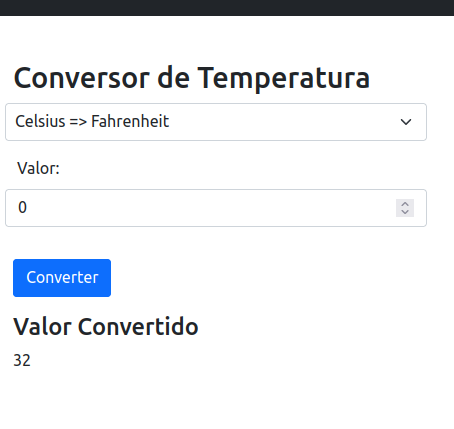

# Instruções:

1. Reinicie um cluster, exemplo usando k3d:
```bash
k3d cluster delete meucluster
k3d cluster create meucluster -p "80:30001@loadbalancer"
```

NodePort ficará em 300001 com suporte a load balancer

2. Execute o seguinte comando na raíz de `conversao-temperatura-k8s` para realiar o deploy:
```bash
kubectl apply -f deployment.yaml
```

3. Use sua aplicação!

