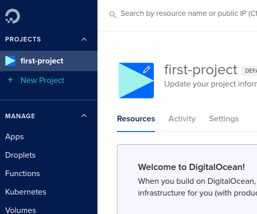
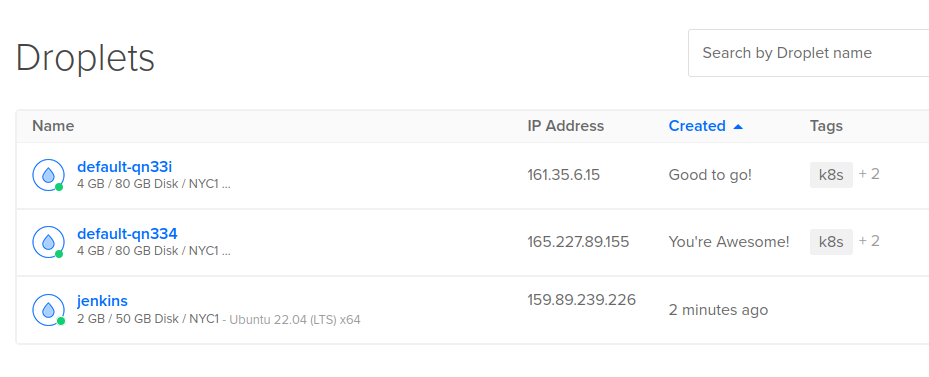
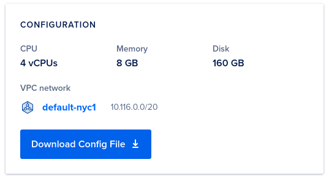
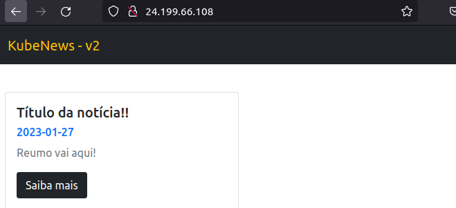
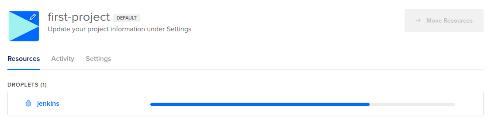
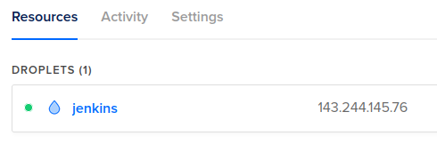
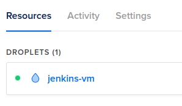

# Aula 3

## Introdução ao Terraform

O Terraform é usado para provisionamento de serviços, a ferramenta permite trabalhar com o conceito de infraestrutura como código através da declaração de elementos da infraestrutura e criação de recursos.

A linguagem usada para estas declarações é a Hashicorp Configuration Language e tem a seguinte estrutura:

```tf
<BLOCK TYPE> "<BLOCK LABEL>" "<BLOCK LABEL>" {
    <IDENTIFIER> = "<EXPRESSION>""
}
```

Alguns tipos de blocos podem ser utilizados:

### resource

Exemplo de um `resource`:

```tf
resource "digitalocean_droplet" "maquina_labs_tf" {
    image = "ubuntu"
    name = "maquina-labs-tf"
    region = "nyc1"
    size = "s-1vcpu-2gb"
}
```

> Representa um recurso no Cloud Provider, segue acompanhado com o tipo de recurso `digitalocean_droplet` seguido do nome do bloco `maquina_labs_tf`.

> Os identificadores e expressões vão declarar os recursos da máquina

### datasource

```tf
data "digitalocean_ssh_key" "minha_chave" {
    name = "aula"
}
```

> É um recurso já criado no Cloud Provider

### providers

```tf
provider "digitalocean" {
    token = ""
}
```

### Terraform Settings

```tf
terraform {
    required_version = ">1.0"
    required_providers {
        digitalocean = {
            source = "digitalocean/digitalocean"
            version = "2.16.0"
        }
    }
}
```

> Este bloco representa as configurações do terraform para o seu projeto.

### variables

```tf
variable "regiao" {
    type = string
    default = "nyc1"
    description = "Região de uso na Digital Ocean"
}
```

### outputs 

```tf
output "droplet_ip" {
    value = digitalocean_droplet.maquina_labs_tf.ipv4_address
}
```

> Usado quando você quer um retorno do valor de algum elemnto do seu projeto

## Digital Ocean

Fiz conta na Digital Ocean e cadastrei o cartão



Primeiro será necessário a criação de uma chave ssh

```bash
❯ ssh-keygen -t rsa -b 2048
Generating public/private rsa key pair.
Enter file in which to save the key (/home/taffarel55/.ssh/id_rsa): /home/taffarel55/.ssh/terraform-digitalocean
Enter passphrase (empty for no passphrase): 
Enter same passphrase again: 
Your identification has been saved in /home/taffarel55/.ssh/terraform-digitalocean
Your public key has been saved in /home/taffarel55/.ssh/terraform-digitalocean.pub
```

Agora copia a chave pública e coloca na digital ocean:

```bash
cat ~/.ssh/terraform-digitalocean.pub
```

Após cadastrar na digital ocean, foi criado um cluster kubernetes na digital ocean com 2 nodes e um droplet para o jenkins



### Acessando as máquinas

A máquina do jenkins pode ser acessada via ssh:

```bash
❯ ssh -i ~/.ssh/terraform-digitalocean root@159.89.239.226
The authenticity of host '159.89.239.226 (159.89.239.226)' can't be established.
ECDSA key fingerprint is SHA256:g8/MgYHoVevOo/jCILH/2CL2ek1OwDmRAi036EkXv3o.
Are you sure you want to continue connecting (yes/no/[fingerprint])? yes
Warning: Permanently added '159.89.239.226' (ECDSA) to the list of known hosts.
Welcome to Ubuntu 22.04.1 LTS (GNU/Linux 5.15.0-50-generic x86_64)

 * Documentation:  https://help.ubuntu.com
 * Management:     https://landscape.canonical.com
 * Support:        https://ubuntu.com/advantage

  System information as of Fri Jan 27 18:40:19 UTC 2023

  System load:  0.0               Users logged in:       0
  Usage of /:   3.2% of 48.27GB   IPv4 address for eth0: 159.89.239.226
  Memory usage: 11%               IPv4 address for eth0: 10.10.0.5
  Swap usage:   0%                IPv4 address for eth1: 10.116.0.2
  Processes:    95

0 updates can be applied immediately.


The programs included with the Ubuntu system are free software;
the exact distribution terms for each program are described in the
individual files in /usr/share/doc/*/copyright.

Ubuntu comes with ABSOLUTELY NO WARRANTY, to the extent permitted by
applicable law.

root@jenkins:~#
```

Já estamos dentro da máquina do jenkins!

```bash
root@jenkins:~# cd /
root@jenkins:/# ls
bin   dev  home  lib32  libx32      media  opt   root  sbin  srv  tmp  var
boot  etc  lib   lib64  lost+found  mnt    proc  run   snap  sys  usr
```

### Acessando o cluster

No site da digital ocean, foi obtido o arquivo de configuração:



Este arquivo de configuração fornece os dados de acesso para o cluster e deve ser adicionado ao arquivo, o substituindo:

```bash
❯ code ~/.kube/config

❯ kubectl get nodes
NAME            STATUS   ROLES    AGE   VERSION
default-qn334   Ready    <none>   24m   v1.25.4
default-qn33i   Ready    <none>   26m   v1.25.4
```

Funcionou! Foi conectado ao cluster numa boa! :smiley: 

### Testando um manifesto

Usando o projeto `kube-news` da aula 2:

```bash
❯ cd aula2/kube-news/k8s

❯ kubectl apply -f deployment.yaml
deployment.apps/postgres created
service/postgres created
deployment.apps/web created
service/web created

❯ kubectl get pods
NAME                       READY   STATUS              RESTARTS   AGE
postgres-5d76d698b-wk6rw   0/1     ContainerCreating   0          13s
web-679b6b7c6-22w8v        0/1     ContainerCreating   0          12s
web-679b6b7c6-bmpww        0/1     ContainerCreating   0          12s
web-679b6b7c6-cq5p9        0/1     ContainerCreating   0          12s
web-679b6b7c6-fgtt2        0/1     ContainerCreating   0          12s
web-679b6b7c6-mkf6f        0/1     ContainerCreating   0          12s

❯ kubectl get services
NAME         TYPE        CLUSTER-IP       EXTERNAL-IP   PORT(S)        AGE
kubernetes   ClusterIP   10.245.0.1       <none>        443/TCP        40m
postgres     ClusterIP   10.245.109.126   <none>        5432/TCP       46s
web          NodePort    10.245.77.123    <none>        80:30000/TCP   45s
```

Observa-se que o service da aplicação web está como NodePort. Iremos agora colocar o LoadBalancer para acessar externamente.

Assim, o type do service será um LoadBalancer, este novo arquivo será criado aqui nas pastas da aula 3 (`kubenews-k8s-digitalocean`) para não editar um arquivo da aula anterior. Sendo assim, o `spec` do serviço web ficou:

```yaml
spec:
  selector:
    app: web
  ports:
    - port: 80
      targetPort: 8080
  type: LoadBalancer
```

E após a execução:

```bash
❯ kubectl apply -f deployment.yaml
deployment.apps/postgres configured
service/postgres unchanged
deployment.apps/web configured
service/web configured

❯ kubectl get all
NAME                           READY   STATUS    RESTARTS       AGE
pod/postgres-5d76d698b-wk6rw   1/1     Running   0              9m48s
pod/web-679b6b7c6-22w8v        1/1     Running   0              9m47s
pod/web-679b6b7c6-bmpww        1/1     Running   0              9m47s
pod/web-679b6b7c6-cq5p9        1/1     Running   1 (8m8s ago)   9m47s
pod/web-679b6b7c6-fgtt2        1/1     Running   0              9m47s
pod/web-679b6b7c6-mkf6f        1/1     Running   0              9m47s

NAME                 TYPE           CLUSTER-IP       EXTERNAL-IP   PORT(S)        AGE
service/kubernetes   ClusterIP      10.245.0.1       <none>        443/TCP        49m
service/postgres     ClusterIP      10.245.109.126   <none>        5432/TCP       9m49s
service/web          LoadBalancer   10.245.77.123    <pending>     80:30000/TCP   9m48s

NAME                       READY   UP-TO-DATE   AVAILABLE   AGE
deployment.apps/postgres   1/1     1            1           9m49s
deployment.apps/web        5/5     5            5           9m48s

NAME                                 DESIRED   CURRENT   READY   AGE
replicaset.apps/postgres-5d76d698b   1         1         1       9m49s
replicaset.apps/web-679b6b7c6        5         5         5       9m48s
```

Já podemos ver o service LoadBalance como pending e após algum tempo.. ALAKAZAN!



> O IP externo foi obtido após outro comando `kubectl get all`

Agora que deu certo, vamos destruir tudo para usar o Terraform kkk

> Fui lá na Digital Ocean e dei o destroy em tudo

## Terraform

Primeiro criei uma pasta do terraform, é uma boa prática começar o arquivo terraform com `main.tf`

Primeiro vá no site [registry.terraform.io](https://registry.terraform.io/). Este cara é um repositório de providers do terraform, de forma parecida como o Dockerhub, Github.

Neste site, procurei o Digital Ocean como provider e encontrei a documentação do uso. 

O bloco inicial de configuração foi o apresentado abaixo:

```tf
terraform {
  required_providers {
    digitalocean = {
      source = "digitalocean/digitalocean"
      version = "~> 2.0"
    }
  }
}

provider "digitalocean" {
  token = var.do_token
}
```

Paga pegar esse token, temos que ir no Digital Ocean, ir em API e gerar um token de uso.

Após isso, preencher o token:

```tf
provider "digitalocean" {
  token = "dop_v1_abcdefg...123456"
}
```

Após isso, é executado:

```bash
❯ terraform init

Initializing the backend...

Initializing provider plugins...
- Finding digitalocean/digitalocean versions matching "~> 2.0"...
- Installing digitalocean/digitalocean v2.25.2...
- Installed digitalocean/digitalocean v2.25.2 (signed by a HashiCorp partner, key ID F82037E524B9C0E8)

Partner and community providers are signed by their developers.
If you'd like to know more about provider signing, you can read about it here:
https://www.terraform.io/docs/cli/plugins/signing.html

Terraform has created a lock file .terraform.lock.hcl to record the provider
selections it made above. Include this file in your version control repository
so that Terraform can guarantee to make the same selections by default when
you run "terraform init" in the future.

Terraform has been successfully initialized!

You may now begin working with Terraform. Try running "terraform plan" to see
any changes that are required for your infrastructure. All Terraform commands
should now work.

If you ever set or change modules or backend configuration for Terraform,
rerun this command to reinitialize your working directory. If you forget, other
commands will detect it and remind you to do so if necessary.
```

A partir disso eu consigo escrever os recursos que eu quero utilizar na minha infraestrutura.

### Droplet

No terraform Registry vou pesquisar como criar um droplet foi criado dessa forma:

```
resource "digitalocean_droplet" "jenkins" {
  image  = "ubuntu-22-04-x64"
  name   = "jenkins"
  region = "nyc1"
  size   = "s-2vcpu-2gb"
}
```

Valores que eu tinha dúvida pesquisei na internet

Para aplicar essa configuração do arquivo main.tf, usa-se o seguinte comando

```bash
❯ terraform apply

Terraform used the selected providers to generate the following execution plan. Resource actions are indicated
with the following symbols:
  + create

Terraform will perform the following actions:

  # digitalocean_droplet.jenkins will be created
  + resource "digitalocean_droplet" "jenkins" {
      + backups              = false
      + created_at           = (known after apply)
      + disk                 = (known after apply)
      + graceful_shutdown    = false
      + id                   = (known after apply)
      + image                = "ubuntu-22-04-x64"
      + ipv4_address         = (known after apply)
      + ipv4_address_private = (known after apply)
      + ipv6                 = false
      + ipv6_address         = (known after apply)
      + locked               = (known after apply)
      + memory               = (known after apply)
      + monitoring           = false
      + name                 = "jenkins"
      + price_hourly         = (known after apply)
      + price_monthly        = (known after apply)
      + private_networking   = (known after apply)
      + region               = "nyc1"
      + resize_disk          = true
      + size                 = "s-2vcpu-2gb"
      + status               = (known after apply)
      + urn                  = (known after apply)
      + vcpus                = (known after apply)
      + volume_ids           = (known after apply)
      + vpc_uuid             = (known after apply)
    }

Plan: 1 to add, 0 to change, 0 to destroy.

Do you want to perform these actions?
  Terraform will perform the actions described above.
  Only 'yes' will be accepted to approve.

  Enter a value: yes

digitalocean_droplet.jenkins: Creating...
digitalocean_droplet.jenkins: Still creating... [10s elapsed]
digitalocean_droplet.jenkins: Still creating... [20s elapsed]
digitalocean_droplet.jenkins: Still creating... [30s elapsed]
digitalocean_droplet.jenkins: Still creating... [40s elapsed]
digitalocean_droplet.jenkins: Creation complete after 43s [id=337885008]

Apply complete! Resources: 1 added, 0 changed, 0 destroyed.
```

Enquanto era criado:



Após criação:



Um arquivo `terraform.tfstate` é criado com as informações atuais dos recursos.

A medida em que usamos, também é criado um `terraform.tfstate.backup`, onde é guardado o estado anterior

Vamos mudar o nome do droplet agora!

Renomendo o name para `jenkins-vm`:

```tf
resource "digitalocean_droplet" "jenkins" {
  image  = "ubuntu-22-04-x64"
  name   = "jenkins-vm"
  region = "nyc1"
  size   = "s-2vcpu-2gb"
}
```

```bash
❯ terraform apply
digitalocean_droplet.jenkins: Refreshing state... [id=337885008]

Terraform used the selected providers to generate the following execution plan. Resource actions are indicated
with the following symbols:
  ~ update in-place

Terraform will perform the following actions:

  # digitalocean_droplet.jenkins will be updated in-place
  ~ resource "digitalocean_droplet" "jenkins" {
        id                   = "337885008"
      ~ name                 = "jenkins" -> "jenkins-vm"
        tags                 = []
        # (22 unchanged attributes hidden)
    }

Plan: 0 to add, 1 to change, 0 to destroy.

Do you want to perform these actions?
  Terraform will perform the actions described above.
  Only 'yes' will be accepted to approve.

  Enter a value: yes

digitalocean_droplet.jenkins: Modifying... [id=337885008]
digitalocean_droplet.jenkins: Still modifying... [id=337885008, 10s elapsed]
digitalocean_droplet.jenkins: Modifications complete after 13s [id=337885008]

Apply complete! Resources: 0 added, 1 changed, 0 destroyed.
```



> Nota-se que ele fez apenas uma pequena modificação

Agora vamos mudar a região do recurso para `"nyc3"`:

```
❯ terraform apply
digitalocean_droplet.jenkins: Refreshing state... [id=337885008]

Terraform used the selected providers to generate the following execution plan. Resource actions are indicated
with the following symbols:
-/+ destroy and then create replacement

Terraform will perform the following actions:

  # digitalocean_droplet.jenkins must be replaced
-/+ resource "digitalocean_droplet" "jenkins" {
      ~ created_at           = "2023-01-27T21:28:16Z" -> (known after apply)
      ~ disk                 = 60 -> (known after apply)
      ~ id                   = "337885008" -> (known after apply)
      ~ ipv4_address         = "143.244.145.76" -> (known after apply)
      ~ ipv4_address_private = "10.116.0.2" -> (known after apply)
      + ipv6_address         = (known after apply)
      ~ locked               = false -> (known after apply)
      ~ memory               = 2048 -> (known after apply)
      ~ name                 = "jenkins-vm" -> "jenkins"
      ~ price_hourly         = 0.02679 -> (known after apply)
      ~ price_monthly        = 18 -> (known after apply)
      ~ private_networking   = true -> (known after apply)
      ~ region               = "nyc1" -> "nyc3" # forces replacement
      ~ status               = "active" -> (known after apply)
      - tags                 = [] -> null
      ~ urn                  = "do:droplet:337885008" -> (known after apply)
      ~ vcpus                = 2 -> (known after apply)
      ~ volume_ids           = [] -> (known after apply)
      ~ vpc_uuid             = "570e7ca9-9163-4b2a-8ca6-e6b5016a404c" -> (known after apply)
        # (7 unchanged attributes hidden)
    }

Plan: 1 to add, 0 to change, 1 to destroy.

Do you want to perform these actions?
  Terraform will perform the actions described above.
  Only 'yes' will be accepted to approve.

  Enter a value: yes

digitalocean_droplet.jenkins: Destroying... [id=337885008]
digitalocean_droplet.jenkins: Still destroying... [id=337885008, 10s elapsed]
digitalocean_droplet.jenkins: Still destroying... [id=337885008, 20s elapsed]
digitalocean_droplet.jenkins: Destruction complete after 22s
digitalocean_droplet.jenkins: Creating...
digitalocean_droplet.jenkins: Still creating... [10s elapsed]
digitalocean_droplet.jenkins: Still creating... [20s elapsed]
digitalocean_droplet.jenkins: Still creating... [30s elapsed]
digitalocean_droplet.jenkins: Still creating... [40s elapsed]
digitalocean_droplet.jenkins: Creation complete after 42s [id=337886489]

Apply complete! Resources: 1 added, 0 changed, 1 destroyed.
```

Neste caso como há uma troca de região, o jenkins precisou ser replaced, ele foi destruído e adicionado em outra região. Neste caso pode causar downtime da aplicação

Estes recursos foram criados sem a especificação da chave ssh criada anteriormente. Nesse caso, essa chave já está criada e configurada  na Digital Ocean

É preciso vincular um elemento de infra que já está criado na Digital Ocean e víncular a um resource que estamos criando. Para isso vamos usar o datasource

Vamos na documentação do Registry do Terraform e olhamos o data source `digitalocean_ssh_key`, para fazer a alteração basta criar um data source e adicionar a chave ssh no resource Droplet como mostra a seguir:

```tf
resource "digitalocean_droplet" "jenkins" {
  image  = "ubuntu-22-04-x64"
  name   = "jenkins"
  region = "nyc3"
  size   = "s-2vcpu-2gb"
  ssh_keys = [data.digitalocean_ssh_key.jornada.id]
}

data "digitalocean_ssh_key" "jornada" {
  name = "Jornada"
}
```

Este nome deve corresponder ao nome da chave criada na Digital Ocean

Após isso ele vai recriar os recursos e vai ser possível acessar o jenkins via ssh através 

```bash
❯ ssh -i ~/.ssh/terraform-digitalocean root@159.223.100.171
Welcome to Ubuntu 22.04.1 LTS (GNU/Linux 5.15.0-50-generic x86_64)

 * Documentation:  https://help.ubuntu.com
 * Management:     https://landscape.canonical.com
 * Support:        https://ubuntu.com/advantage

  System information as of Fri Jan 27 22:03:16 UTC 2023

  System load:  0.0849609375      Users logged in:       0
  Usage of /:   2.7% of 57.97GB   IPv4 address for eth0: 159.223.100.171
  Memory usage: 11%               IPv4 address for eth0: 10.10.0.5
  Swap usage:   0%                IPv4 address for eth1: 10.116.0.2
  Processes:    108

0 updates can be applied immediately.


Last login: Fri Jan 27 22:03:17 2023 from 187.107.8.243
root@jenkins:~# 
```

### Cluster

Olhando o Registry do Terraform, na documentação do Digital Ocean, é encontrado o resource `digitalocean_kubernetes_cluster` e é adicionado ao `main.tf` o seguinte trecho de código:

```tf
resource "digitalocean_kubernetes_cluster" "k8s" {
  name   = "k8s"
  region = "nyc1"
  # Grab the latest version slug from `doctl kubernetes options versions`
  version = "1.25.4-do.0"

  node_pool {
    name       = "default"
    size       = "s-2vcpu-2gb"
    node_count = 2
  }
}
```

Antes de executar o apply, vamos conhecer dois comandos..

Formata o arquivo tornando a leitura mais fácil:
```bash
❯ terraform fmt
main.tf
```

Mostra o plano de execução do arquivo:
```bash
❯ terraform plan
data.digitalocean_ssh_key.jornada: Reading...
data.digitalocean_ssh_key.jornada: Read complete after 0s [name=Jornada]
digitalocean_droplet.jenkins: Refreshing state... [id=337887575]

Terraform used the selected providers to generate the following execution plan. Resource actions are indicated with the following symbols:
  + create

Terraform will perform the following actions:

  # digitalocean_kubernetes_cluster.k8s will be created
  + resource "digitalocean_kubernetes_cluster" "k8s" {
      + cluster_subnet = (known after apply)
      + created_at     = (known after apply)
      + endpoint       = (known after apply)
      + ha             = false
      + id             = (known after apply)
      + ipv4_address   = (known after apply)
      + kube_config    = (sensitive value)
      + name           = "k8s"
      + region         = "nyc1"
      + service_subnet = (known after apply)
      + status         = (known after apply)
      + surge_upgrade  = true
      + updated_at     = (known after apply)
      + urn            = (known after apply)
      + version        = "1.25.4-do.0"
      + vpc_uuid       = (known after apply)

      + maintenance_policy {
          + day        = (known after apply)
          + duration   = (known after apply)
          + start_time = (known after apply)
        }

      + node_pool {
          + actual_node_count = (known after apply)
          + auto_scale        = false
          + id                = (known after apply)
          + name              = "default"
          + node_count        = 2
          + nodes             = (known after apply)
          + size              = "s-2vcpu-2gb"
        }
    }

Plan: 1 to add, 0 to change, 0 to destroy.
```

Tudo funcionou ok! 

Vamos agora colocar variables para parâmetros que repetimos e credenciais como token, chave ssh.

Para isso foi criado o trecho de código indicando as variáveis e um valor default para elas:

```tf
variable "region" {
  default = ""
}

variable "do_token" {
  default = ""
}

variable "ssh_key_name" {
  default = ""
}
```

E um arquivo `terraform.tfvars` com os valores das variáveis

```
region       = "nyc1"
do_token     = "dop_v1_abcdefg...123456"
ssh_key_name = "Jornada"
```

Após isso, um podemos dar o apply:

```bash
❯ terraform apply
data.digitalocean_ssh_key.ssh_key: Reading...
digitalocean_kubernetes_cluster.k8s: Refreshing state... [id=f1611c07-c11d-4e2d-8eac-98ea7b695259]
data.digitalocean_ssh_key.ssh_key: Read complete after 2s [name=Jornada]
digitalocean_droplet.jenkins: Refreshing state... [id=337887575]

No changes. Your infrastructure matches the configuration.

Terraform has compared your real infrastructure against your configuration and found no differences, so no
changes are needed.

Apply complete! Resources: 0 added, 0 changed, 0 destroyed.
```

No momento ainda temos 2 problemas, a gente ainda precisa ir ver o IP da aplicação lá no terminal web e ainda precisa do terminal web para pegar o kube config do kubernetes.

Para resolver o IP, vamos criar um output para o IP no `main.tf`:

```tf
output jenkins_ip {
  value       = digitalocean_droplet.jenkins.ipv4_address
}
```

> O parâmetro ipv4_address foi obtido vendo na documentação de um droplet, pra saber o que ele tem como atributo

```bash
❯ terraform apply
data.digitalocean_ssh_key.ssh_key: Reading...
digitalocean_kubernetes_cluster.k8s: Refreshing state... [id=f1611c07-c11d-4e2d-8eac-98ea7b695259]
data.digitalocean_ssh_key.ssh_key: Read complete after 1s [name=Jornada]
digitalocean_droplet.jenkins: Refreshing state... [id=337887575]

Changes to Outputs:
    # (1 unchanged attribute hidden)

You can apply this plan to save these new output values to the Terraform state, without changing any real
infrastructure.

Do you want to perform these actions?
  Terraform will perform the actions described above.
  Only 'yes' will be accepted to approve.

  Enter a value: yes


Apply complete! Resources: 0 added, 0 changed, 0 destroyed.

Outputs:

jenkins_ip = "159.223.100.171"
```

> Podemos ver que o IP foi retornado adequadamente.

Para resolver o problema do kube config criaremos um `resource`, este é da `hashcorp/local`, então após a configuração, devemos atualizar o arquivo lock file executando um `terraform init`:

Trecho de configuração:
```tf
resource "local_file" "name" {
  content  = digitalocean_kubernetes_cluster.k8s.kube_config.0.raw_config
  filename = "${path.module}/kube_config.yaml"
}
```

> O parâmetro do content foi obtido vendo na documentação de um kubernetes no terraform, pra saber o que ele tem como atributo

Após isso, executa-se os comandos:

```bash
❯ terraform init
❯ terraform apply
data.digitalocean_ssh_key.ssh_key: Reading...
digitalocean_kubernetes_cluster.k8s: Refreshing state... [id=f1611c07-c11d-4e2d-8eac-98ea7b695259]
data.digitalocean_ssh_key.ssh_key: Read complete after 1s [name=Jornada]
digitalocean_droplet.jenkins: Refreshing state... [id=337887575]

Terraform used the selected providers to generate the following execution plan. Resource actions are indicated with the
following symbols:
  + create

Terraform will perform the following actions:

  # local_file.name will be created
  + resource "local_file" "name" {
      + content              = (sensitive value)
      + directory_permission = "0777"
      + file_permission      = "0777"
      + filename             = "./outputfile"
      + id                   = (known after apply)
    }

Plan: 1 to add, 0 to change, 0 to destroy.

Do you want to perform these actions?
  Terraform will perform the actions described above.
  Only 'yes' will be accepted to approve.

  Enter a value: yes

local_file.name: Creating...
local_file.name: Creation complete after 0s [id=b0c2226f93c73cdf6b23838ec708dcb0656f0fb0]

Apply complete! Resources: 1 added, 0 changed, 0 destroyed.

Outputs:

jenkins_ip = "159.223.100.171"
```

O arquivo vai ser retornado e criado, após isso, basta copiar as configurações dele para o kube/config

```bash
❯ cp ./kube_config.yaml ~/.kube/config

❯ kubectl get nodes
NAME            STATUS   ROLES    AGE   VERSION
default-qnc30   Ready    <none>   61m   v1.25.4
default-qnc3d   Ready    <none>   61m   v1.25.4
```

E assim temos os nodes:
```bash
❯ kubectl get nodes
NAME            STATUS   ROLES    AGE   VERSION
default-qnc30   Ready    <none>   99m   v1.25.4
default-qnc3d   Ready    <none>   99m   v1.25.4
```