# Aula 4

## Pipeline CI e CD

### Integração contínua

No momento em que o desenvolvedor realiza o commit é o ponto de início da pipeline de integração contínua. A partir disso vamos ter várias etapas como por exemplo uma etapa de build, testes e geração de pacote de entrega. E todo o controle do fluxo de entrega da nova versão é feito pelo pipeline garantindo qualidade, segurança e entrega contínua e automática.

<center>

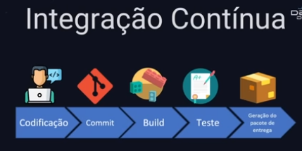

</center>

### Entrega contínua

Ela começa quando já se tem uma realease para ser entregue, começa após a integração contínua. Essa etapa vai ser responsável por entregar uma release um ambiente, pode ser um ambiente de testes, de produção, homologação. A partir do momento em que se tem o pacote, a release podemos ter uma etapa de testes, uma etapa de aceite com alguma equipe responsável por dar o aceite e após o deploy.

<center>

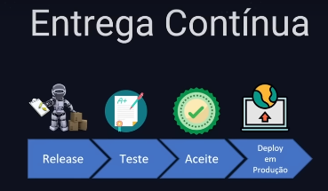

</center>

### Integração Contínua e Entrega Contínua

Em conjunto, elas fazem todo o fluxo de entrega de uma nova versão de produto em um ambiente a partir em que é feito um commit

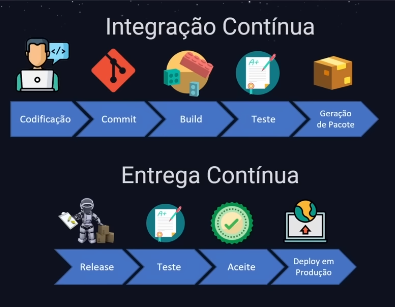

Para fazer esse gerenciamento da pipeline usaremos o Jenkins

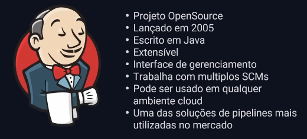

## Projeto

O projeto vai consistir do jenkins ser disparado quando acontecer um commit, ele criar imagem Docker e o Kubernetes vai usar essa imagem para subir na infraestrutura.

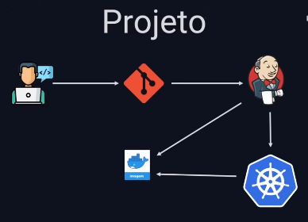

Primeiro passo será usar o Terraform para provisionar a infra, os arquivos do terraform estão na pasta `terraform`

```bash
❯ terraform apply
...
jenkins_ip = "198.211.97.23"

❯ cp ./kube_config.yaml ~/.kube/config
```

### Preparando o jenkins

Pronto, agora vamos instalar o jenkins na máquina virtual.

```bash
❯ ssh -i ~/.ssh/terraform-digitalocean root@198.211.97.23
...
root@jenkins:~#
```

O jenkins precisa do Java, para isso:

```bash
root@jenkins:~# apt update
...
Reading package lists... Done
Building dependency tree... Done
Reading state information... Done
107 packages can be upgraded. Run 'apt list --upgradable' to see them.
```

```bash
root@jenkins:~# apt install openjdk-17-jdk -y
...
done
```

A partir disso, o Java está instalado e podemos usar a documentação para instalar o jenkins:

```bash
curl -fsSL https://pkg.jenkins.io/debian-stable/jenkins.io.key | sudo tee \
  /usr/share/keyrings/jenkins-keyring.asc > /dev/null
echo deb [signed-by=/usr/share/keyrings/jenkins-keyring.asc] \
  https://pkg.jenkins.io/debian-stable binary/ | sudo tee \
  /etc/apt/sources.list.d/jenkins.list > /dev/null
sudo apt-get update
sudo apt-get install jenkins
```

Agora é preciso instalar algumas ferramentas que vamos trabalhar como o `Docker` e o `kubectl`.

Para instalar o `Docker`:

```bash
curl -fsSL https://get.docker.com | sh
```

Agora vamos adicionar o jenkins ao grupo docker para ele poder utilizar o docker

```bash
root@jenkins:~# usermod -aG docker jenkins
root@jenkins:~# systemctl restart jenkins
root@jenkins:~# systemctl status jenkins
● jenkins.service - Jenkins Continuous Integration Server
     Loaded: loaded (/lib/systemd/system/jenkins.service; enabled; vendor preset: enabled)
     Active: active (running) since Sat 2023-01-28 14:08:32 UTC; 21s ago
   Main PID: 12509 (java)
      Tasks: 52 (limit: 2324)
     Memory: 650.3M
        CPU: 37.329s
     CGroup: /system.slice/jenkins.service
             └─12509 /usr/bin/java -Djava.awt.headless=true -jar /usr/share/java/jenkins.war --webroot=/var/cache/jenkins/war>
lines 1-9/9 (END)
```

> Docker instalado! 🐋

Agora vamos instalar o `kubectl`:

```bash
sudo apt-get update
sudo apt-get install -y ca-certificates curl
sudo apt-get install -y apt-transport-https
sudo curl -fsSLo /etc/apt/keyrings/kubernetes-archive-keyring.gpg https://packages.cloud.google.com/apt/doc/apt-key.gpg
echo "deb [signed-by=/etc/apt/keyrings/kubernetes-archive-keyring.gpg] https://apt.kubernetes.io/ kubernetes-xenial main" | sudo tee /etc/apt/sources.list.d/kubernetes.list
sudo apt-get update
sudo apt-get install -y kubectl
```

✅ Pronto! Máquina jenkins 🕴️ com os programas instalados:

- Docker 🐋
- kubectl ☸

### Configurando o Jenkins

No navegador, acesse `http://198.211.97.23:8080` e uma página como essa vai ser vista:

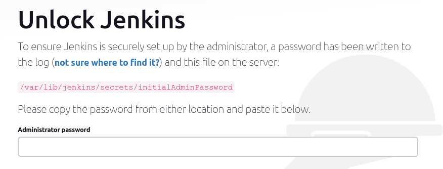

E para encontrar essa chave, só executar:

```bash
root@jenkins:~# cat /var/lib/jenkins/secrets/initialAdminPassword
```

Inicialmente instale plugins sugeridos, após a instalação ele vai pedir um cadastro.

Após este cadastro o jenkins estará configurado e iremos instalar as extensões do Docker e Kubernetes:

Manage Jenkins > Manage Plugins > Available plugins

Selecione e docker e kubernetes:

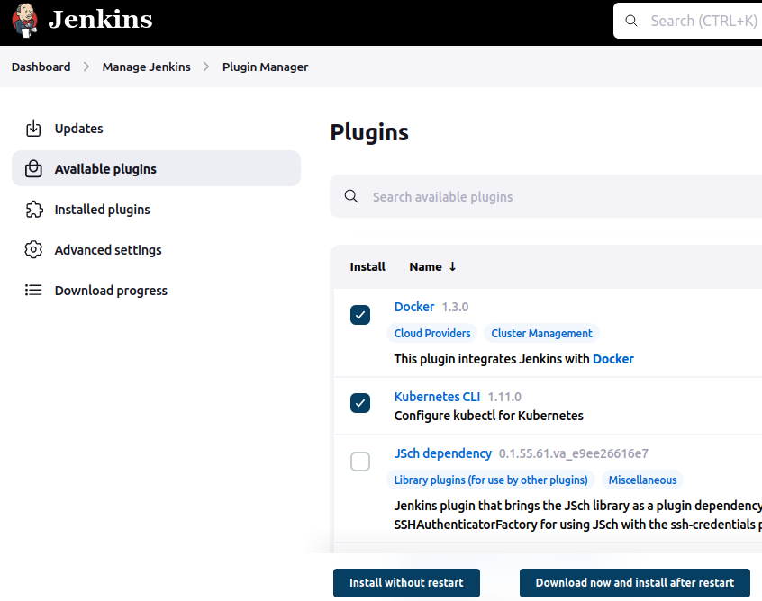

Clique em **Download now and install after restart**

> [EDIT] Instalar também o docker pipeline

Reinicie o Jenkins

Faça o login no Jenkins com suas credenciais

## Criando o pipeline no Jenkins

1. Clique em New Item / Nova tarefa
2. Escolha pipeline
3. No campo pipeline escolha "Pipeline script from SCM"

Isso é importante para escrever o script a partir do de um repositório git e ser versionado

4. Configure o repositório git
   - URL: `https://github.com/taffarel55/jornada-devops-elite.git`
   - Branch: `*/main`
   - Script Path: `aula4/kube-news/jenkins/Jenkinsfile`
5. Clique em salvar

Após isso o arquivo Jenkinsfile foi criado inicialmente da seguinte forma:

```jenkins
pipeline {
    agent any

    stages {

        stage ('Build Docker Image') {
            steps {
                script {
                    dockerapp = docker.build("taffarel55/kube-news:${env.BUILD_ID}", '-f ./aula4/kube-news/src/Dockerfile ./aula4/kube-news/src')
                }
            }
        }

    }
}
```

> O arquivo ainda vai ser editado, esta é uma versão parcial

Após um build manual no Jenkins é possível ver os stages:

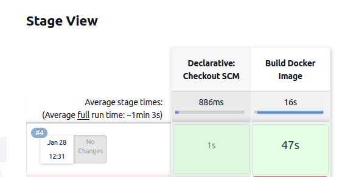

Imagem construída, agora vamos fazer um push para o Docker Registry, mas para criar essa instrução no Jenkinsfile, é preciso criar essa credencial no serviço Jenkins.

Manage Jenkins > Manager Credentials > System > Global Credentials > Add Credentials

Kind: Username with Password
Username: usuario-aqui
Password: senha-aqui
ID: dockerhub

Após a criação da credencial, podemos fazer adicionar um novo stage:

```jenkins
stage ('Push Docker Image') {
    steps {
        script {
            docker.withRegistry("https://registry.hub.docker.com", 'dockerhub') {
                dockerapp.push('latest')
                dockerapp.push("${env.BUILD_ID}")
            }
        }
    }
}
```

Após este novo stage:

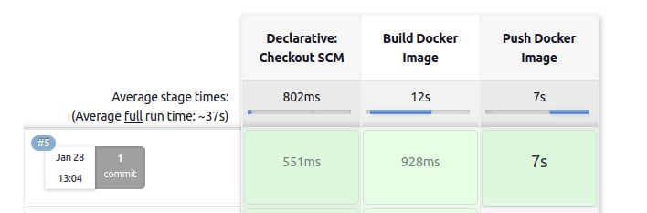

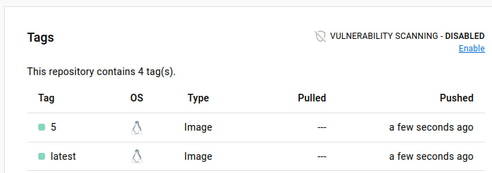

CI está feito! Agora vamos fazer o CD

Para fazer o deploy no kubernetes precisamos do arquivo de configuração kube config, essa credencial será adicionada no Jenkis em uma credencial do tipo `Secret file` e vou selecionar `kube_config.yaml` gerada a partir do provisionamento do cluster com `id=kubeconfig`.

E o stage será criado da seguinte forma:

```jenkins
stage ('Deploy Kubernetes') {
    steps {
        script {
            withKubeConfig([credentialsId: 'kubeconfig']) {
                sh 'kubectl apply -f ./aula4/kube-news/k8s/deployment.yaml'
            }
        }
    }

}
```

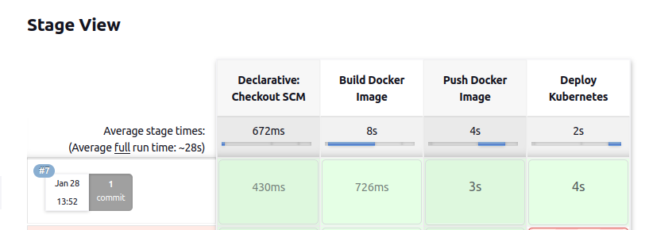

```bash
❯ kubectl get pods
NAME                       READY   STATUS    RESTARTS        AGE
postgres-5d76d698b-x5x87   1/1     Running   0               3m19s
web-679b6b7c6-2wjsm        0/1     Pending   0               3m19s
web-679b6b7c6-chndh        1/1     Running   2 (3m14s ago)   3m19s
web-679b6b7c6-ctrxj        1/1     Running   2 (3m12s ago)   3m19s
web-679b6b7c6-ggsjp        1/1     Running   2 (3m11s ago)   3m19s
web-679b6b7c6-tgb72        1/1     Running   2 (3m13s ago)   3m19
```

Mas ao executar um `kubectl describe pod web-679b6b7c6-chndh` é possível perceber que a imagem que ele utiliza é a antiga, o arquivo `deployment.yaml` tem que ser atualizado.

```yaml
spec:
  containers:
    - name: web
      image: taffarel55/kube-news:{{TAG}}
      ports:
```

Essa tag será preenchida com o `env.BUILD_ID` do Jenkins. Para fazer isso, o stage de deploy no `Jenkinsfile` tem que ser modificado para:

```jenkins
stage ('Deploy Kubernetes') {
    environment {
            tag_version = "${env.BUILD_ID}"
        }
    steps {
        withKubeConfig([credentialsId: 'kubeconfig']) {
                sh 'sed -i "s/{{TAG}}/$tag_version/g" ./aula4/kube-news/k8s/deployment.yaml'
                sh 'kubectl apply -f ./aula4/kube-news/k8s/deployment.yaml'
            }

    }

}
```

Dessa forma, o `env.BUILD_ID` será setado no `tag_version` e o comando `sed` realizará a troca do trecho {{TAG}} do arquivo `deployment.yaml` para o valor de `env.BUILD_ID`.

E por último, vamos ativar o trigger para o serviço iniciar a cada vez que um git commit for dado.

Para isso, vá em configurações do projeto e ative GitHub hook trigger.

Agora pegue o endereço do jenkins com a porta, neste caso o meu é: `http://67.205.148.47:8080`

Vai no github > seettings > webhooks > add new

Em payload url coloque o endereço do jenkins com o seguinte endpoint (inclusive a barra no final):

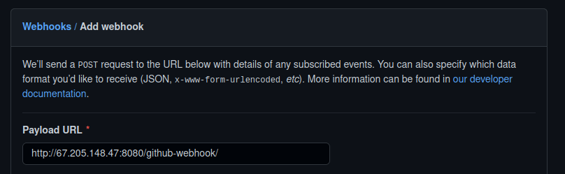

Agora quando um commit for criado, a esteira vai ser executada.

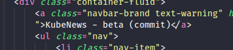

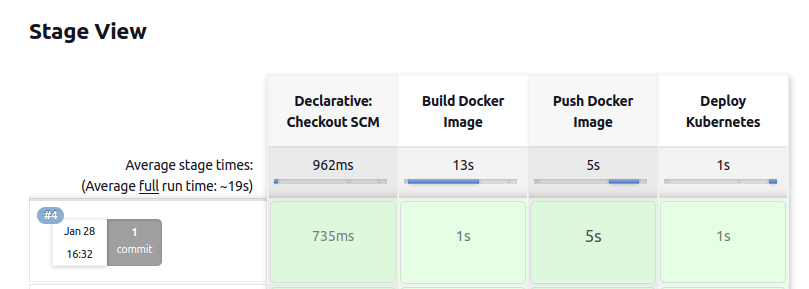

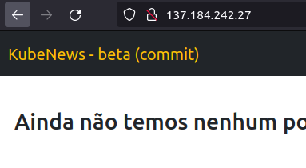