# Aula 5

## Introdução sobre métricas

Métricas são medições numéricas de dados relacionados a elementos do seu software ou da sua infraestrutura e normalmente eles estão relacionados a uma linha temporal.

### Métricas de Sistemas

- Quantidades de requisições
- Quantidades de erros
- Consumo de recursos
- APIs mais acessadas
- Tempo de acesso a um recurso

### Métricas de negócio

- Usuários acessando a aplicação
- Boletos imprimidos
- Compras de um produto

AS equipes responsáveis por estas métricas devem estar alinhahas

> Métrica não é LOG

| Métricas        | Log               |
| :-------------- | :---------------- |
| Dados numéricos | Dados textuais    |
| Gráficos        | Mensagens de erro |
| Agregações      | Informação        |
| Performance     | Buscáveis         |

> Ambos compõe os pilares da observabilidade

## Apresentando o Prometheus

- Criado pela SoundCloud
- OpenSource
- Dados dimensionais (TSDB)
- Múltiplas formas de visualização
- Configuração de alertas
- Projeto graduado na CNCF

### Estrutura do Prometheus

O Prometheus é formado pelo Prometheus Server e dentro do Prometheus Server, temos o time series data base (Storage), tem a parte de consulta PromQL e o Retriveal

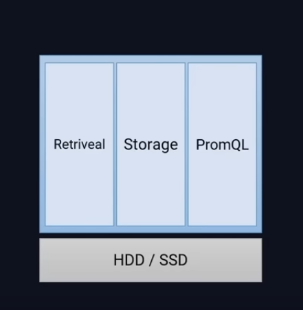

#### TSDB

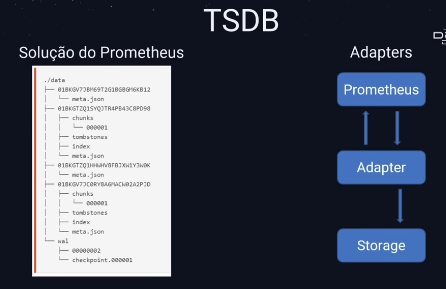

O TSDB armazena os dados em blocos com um número determinado de horas e com o passar do tempo é possível criar regras em que esses dados são compactados dps de por exemplo 30 dias ou um periodo que vc não precisa tanto da precisão dos seus dados.

Uma outra possibilidade é utilizar Adapters para usar outras ferramentas e soluções

#### Retriveal

O Retriveal é a parte de recurso em que vc coleta os dados das métricas nas aplicações. Cada elemento que você vai coletar é chamado de Job.

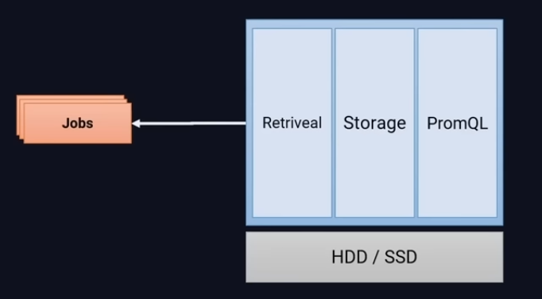

Mas como funciona a coleta de dados?

O Prometheus tem um comportamento ativo na hora de coletar as métricas enquanto que a aplicação tem um comportamento passivo.

A aplicação vai expor as métricas através de um endpoint e o Prometheus vai coletar essas métricas através desse endpoint.

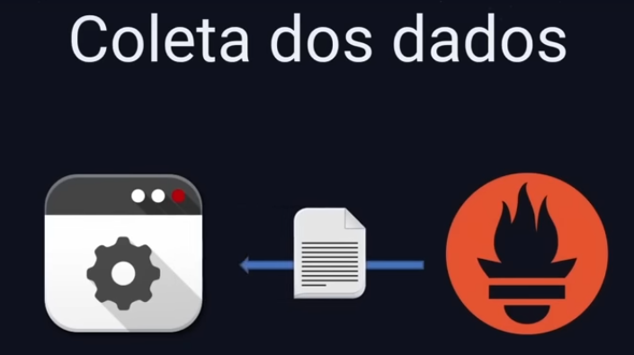

Abaixo temos um exemplo de uma documentação com os pontos onde vão ser coletadas as métricas:

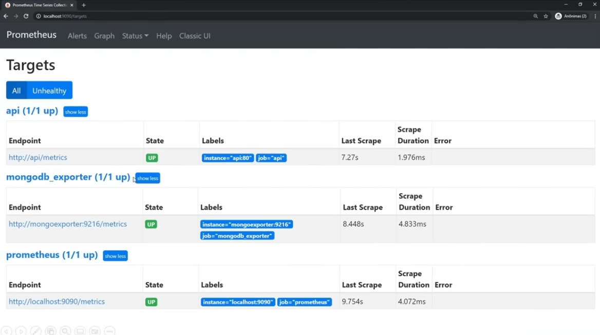

E abaixo um exemplo de formato para expor as métricas:

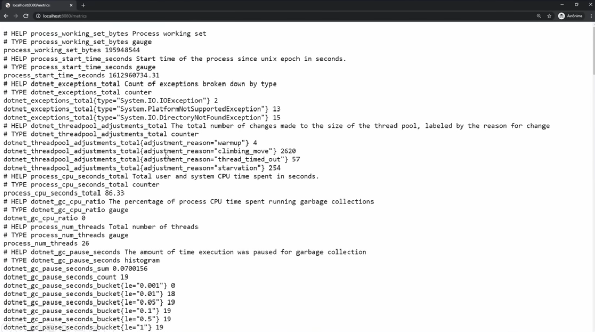

É possível utilizar diversas linguagens suportadas para expor essas métricas, algumas com suporte oficial e outras não.

Além das linguagens, temos bibliotecas que facilitam também o processo de implementar essas métricas:

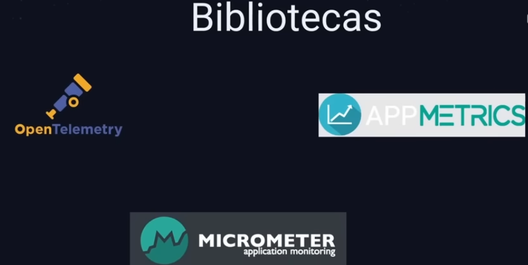

Existem também algumas aplicações com suporte nativo ao Prometheus com uma implementação para expor as métricas, são elas:

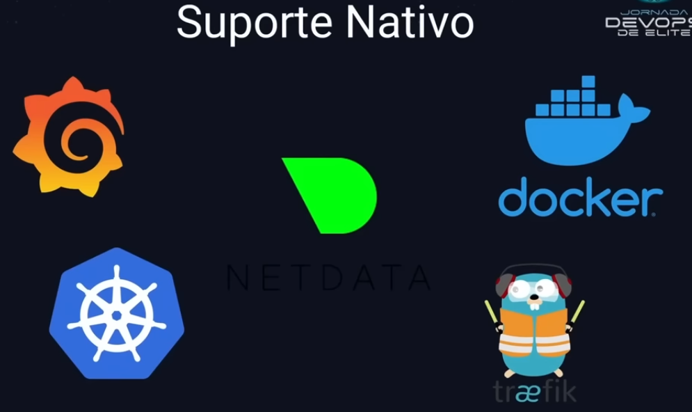

Aplicações sem suporte você vai usar **Exporters**, que são mini aplicações que executam numa camada antes da aplicação.

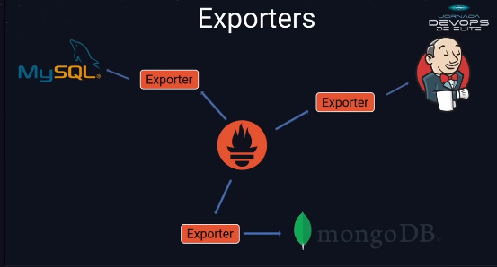

> Olhando a documentação do Prometheus, você pode ver Exporters para diversas ferramentas.

Sendo assim, a estrutura para os Retriveals, tem os Jobs e os Exporters

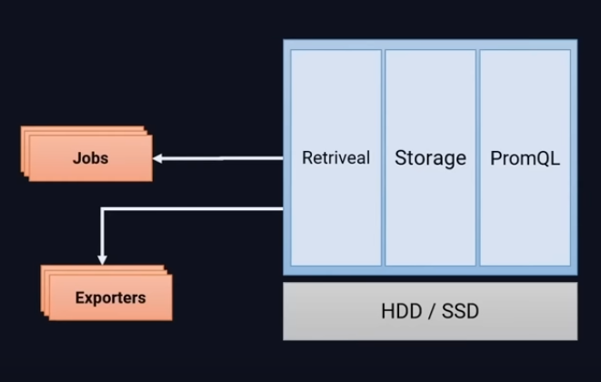

**E processos de curta duração?**

Alguns processos são rápidos e pode não dar tempo o Prometheus coletar como processos em bash, para estes, temos um outro elemento da arquitetura chamado `Push Gateway`.


Desta forma a aplicação vai criar as métricas para o Push Gateway e a aplicação vai obter as métricas desse elemento.

Sendo assim, temos a seguinte arquitetura atual:

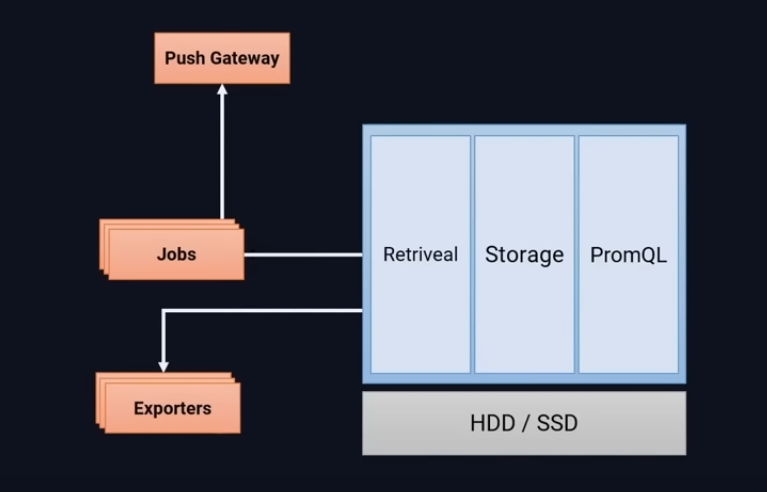

Tem serviços que escalam horizontalmente os processos, containers e para pegar dinâmicamente o endereço desses novos recursos tem um elemento **Service Discovery** que será responsável por isso

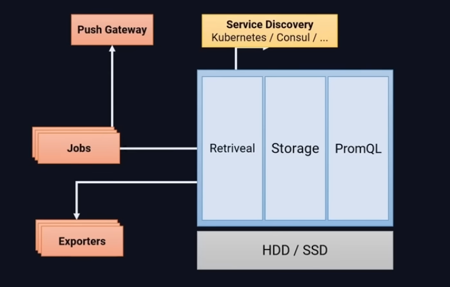

E para visualizar esses dados você pode usar o terminal web do Prometheus:

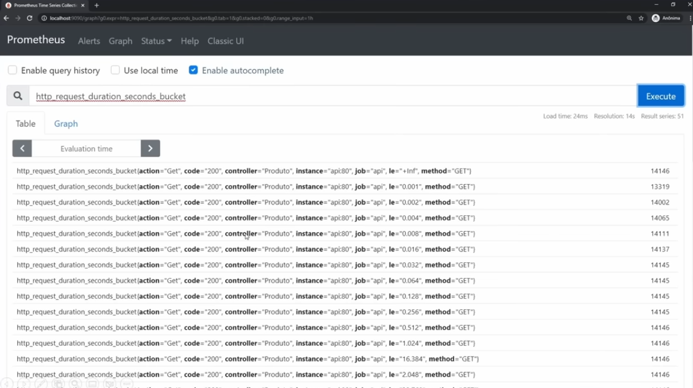

Ou o grafana, possiblitando a criação de diferentes formas de Dashboards:

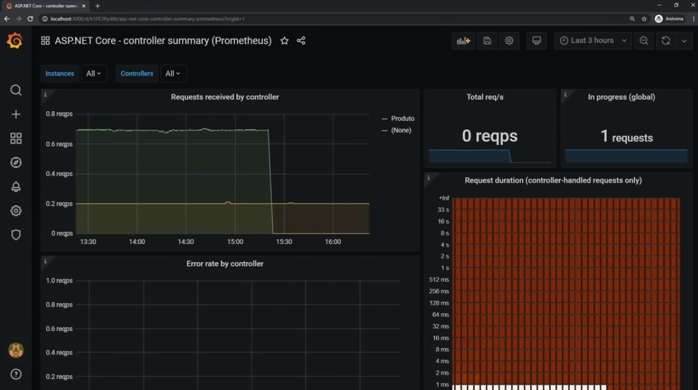

E também pode ser usada a API, formando um conjunto de possibilidades para leitura de métricas:

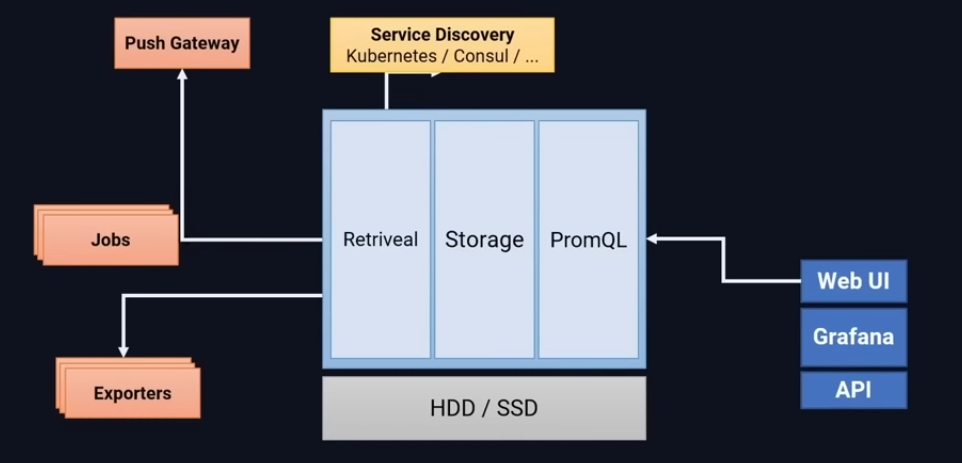

Mas também temos a possiblidade de ler as métricas através de alertas. Para isso um elemento `Alert Manager` recebe um alerta do Prometheus e ele é responsável por redirecionar esse alerta para o local apropriado

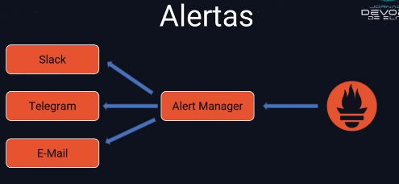

Então agora temos a solução do Prometheus com os principais elementos:

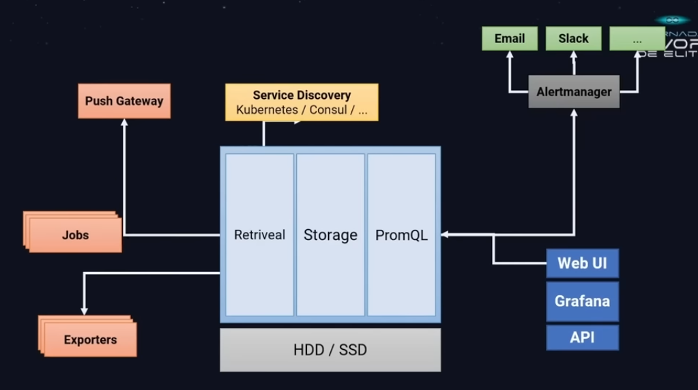

### Configuração do Prometheus

A configuração do Prometheus é feita em arquivo yaml e temos essas sessões como principais:

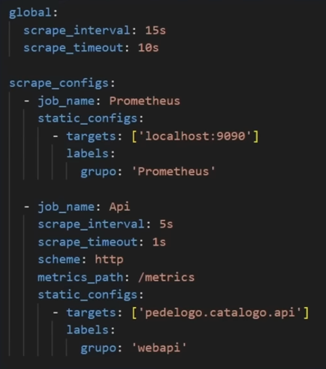

- `global`: Configurações globais
  - `scrape_interval`: Invervalo em que eu vou nos endpoints, exporters, Push Gateway e Service Discovery para coletar as métricas.
  - `scrape_timeout`: Tempo para saber se deu erro ao coletar a métrica
- `scrape_config`: Onde são configurados cada job que vai ser coletado as métricas.
  - `job_name`: Nome do job<br>
    `static_configs`:<br> - targets: `endpoint`<br>
    labels: Coisas para categorizar

Cada job pode ser definido um `scrape_interval` também!

Agora vamos rodar o Prometheus no Kubernetes! 😍

## Subindo serviços de monitoramento no Kubernetes

Como a instalação do Prometheus é complexa e exige o conhecimento de alguns elementos do Kubernetes que não foram falados durante a semana, o manifesto de criação do Kubernetes do Prometheus e o Grafana foram disponibilizados prontos e estão na pasta `./monitoramento/`

Primeiro vamos criar a infra usando o terraform, o arquivo de provisionamento está na pasta `./terraform/`.

Além disso devemos configurar o jenkins novamente como na `aula4`, mas dessa vez, os arquivos de configuração se referirão a pasta da `aula 5`.

> Algumas mudanças foram feitas nos arquivos como mudança da versão do cluster, por isso criei eles novamente na aula 5, além de manter a isolação entre as aulas.

Com tudo configurado:

```bash
❯ kubectl get svc
NAME         TYPE           CLUSTER-IP       EXTERNAL-IP       PORT(S)        AGE
kubernetes   ClusterIP      10.245.0.1       <none>            443/TCP        12m
postgres     ClusterIP      10.245.175.252   <none>            5432/TCP       3m37s
web          LoadBalancer   10.245.97.241    206.189.252.197   80:30728/TCP   3m37s
❯ kubectl get pods
NAME                        READY   STATUS    RESTARTS   AGE
postgres-84b956bd68-k8w54   1/1     Running   0          4m4s
web-68867f89b7-2ztzx        1/1     Running   0          4m4s
web-68867f89b7-m2snp        1/1     Running   0          4m4s
web-68867f89b7-s8g47        1/1     Running   0          4m4s
web-68867f89b7-w4r54        1/1     Running   0          4m4s
web-68867f89b7-wrcnr        1/1     Running   0          4m4s
```


Vamos inciar a instalação dos serviços de monitoramento.

```bash
❯ cd monitoramento
❯ kubectl apply -f deploy-prometheus-grafana.yaml
serviceaccount/prometheus-kube-state-metrics created
serviceaccount/prometheus-node-exporter created
serviceaccount/prometheus-server created
configmap/prometheus-server created
clusterrole.rbac.authorization.k8s.io/prometheus-kube-state-metrics created
clusterrole.rbac.authorization.k8s.io/prometheus-server created
clusterrolebinding.rbac.authorization.k8s.io/prometheus-kube-state-metrics created
clusterrolebinding.rbac.authorization.k8s.io/prometheus-server created
service/prometheus-kube-state-metrics created
service/prometheus-node-exporter created
service/prometheus-server created
daemonset.apps/prometheus-node-exporter created
deployment.apps/prometheus-kube-state-metrics created
deployment.apps/prometheus-server created
Warning: policy/v1beta1 PodSecurityPolicy is deprecated in v1.21+, unavailable in v1.25+
podsecuritypolicy.policy/grafana-test created
serviceaccount/grafana-test created
configmap/grafana-test created
role.rbac.authorization.k8s.io/grafana-test created
rolebinding.rbac.authorization.k8s.io/grafana-test created
pod/grafana-test created
podsecuritypolicy.policy/grafana created
serviceaccount/grafana created
secret/grafana created
configmap/grafana created
clusterrole.rbac.authorization.k8s.io/grafana-clusterrole created
clusterrolebinding.rbac.authorization.k8s.io/grafana-clusterrolebinding created
role.rbac.authorization.k8s.io/grafana created
rolebinding.rbac.authorization.k8s.io/grafana created
service/grafana created
deployment.apps/grafana created
```

```bash
❯ kubectl get pods
NAME                                             READY   STATUS    RESTARTS   AGE
grafana-5894b5b8b6-ntfvm                         1/1     Running   0          33s
grafana-test                                     0/1     Error     0          36s
postgres-84b956bd68-k8w54                        1/1     Running   0          5m17s
prometheus-kube-state-metrics-774f8c7564-9lqvh   1/1     Running   0          39s
prometheus-node-exporter-lmbpk                   1/1     Running   0          39s
prometheus-node-exporter-p22h5                   1/1     Running   0          39s
prometheus-server-6bb8d6ffb6-krx98               1/2     Running   0          38s
web-68867f89b7-2ztzx                             1/1     Running   0          5m17s
web-68867f89b7-m2snp                             1/1     Running   0          5m17s
web-68867f89b7-s8g47                             1/1     Running   0          5m17s
web-68867f89b7-w4r54                             1/1     Running   0          5m17s
web-68867f89b7-wrcnr                             1/1     Running   0          5m17s
```

Temos o grafana, o grafana-test, postgre, 2 node-exporter, state-metrics (requisitos do prometheus) e o prometheus-server.

> Não foram colocados Push Gateway nem Alert Manager pq não vão ser usados.

```
❯ kubectl get services
NAME                            TYPE           CLUSTER-IP       EXTERNAL-IP       PORT(S)        AGE
grafana                         LoadBalancer   10.245.119.142   <pending>         80:31724/TCP   4m33s
kubernetes                      ClusterIP      10.245.0.1       <none>            443/TCP        17m
postgres                        ClusterIP      10.245.175.252   <none>            5432/TCP       9m17s
prometheus-kube-state-metrics   ClusterIP      10.245.58.230    <none>            8080/TCP       4m40s
prometheus-node-exporter        ClusterIP      10.245.93.116    <none>            9100/TCP       4m40s
prometheus-server               LoadBalancer   10.245.175.31    167.172.1.151     80:31493/TCP   4m39s
web                             LoadBalancer   10.245.97.241    206.189.252.197   80:30728/TCP   9m17s
```

```bash
❯ kubectl describe service grafana
Events:
  Type     Reason                  Age                   From                Message
  ----     ------                  ----                  ----                -------
  Warning  SyncLoadBalancerFailed  7m16s                 service-controller  Error syncing load balancer: failed to ensure load balancer: failed to create load-balancer: POST https://api.digitalocean.com/v2/load_balancers: 429 (request "f7e7de58-efb6-4b5c-9be6-ffe3dd66d1b0") You have reached your load balancer limit, maximum allowed 2. Please contact support to raise your load balancer limit.
```

Neste caso o IP do grafana não foi retornado pq a conta free do digital ocean permite no máximo 2 LoadBalancers. Então será feito um port-forwarding em um terminal externo:

```bash
❯ kubectl port-forward service/grafana 8081:80
Forwarding from 127.0.0.1:8081 -> 3000
Forwarding from [::1]:8081 -> 3000
```

E assim o grafana vai ficar disponível na sua máquina em:

```
http://localhost:8081
```

## Investigando os serviços de monitoramento

### Prometheus

Primeiro passo entre no IP do service `prometheus-service`

Uma tela como essa pode ser vista:

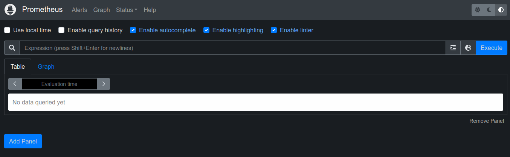

Essa é o terminal web com as configurações e a ferramenta de consulta 

Em `Status > Runtime & Build Information` é possível ver dados em relação ao Runtime e ao Build do Prometheus.

Assim como podemos ir em outros submenús de `Status` e ir ver uma série de outras informações geralmente referentes a configurações.

Em `Status > Target` temos todos os targets que o Prometheus tá monitorando neste exato momento

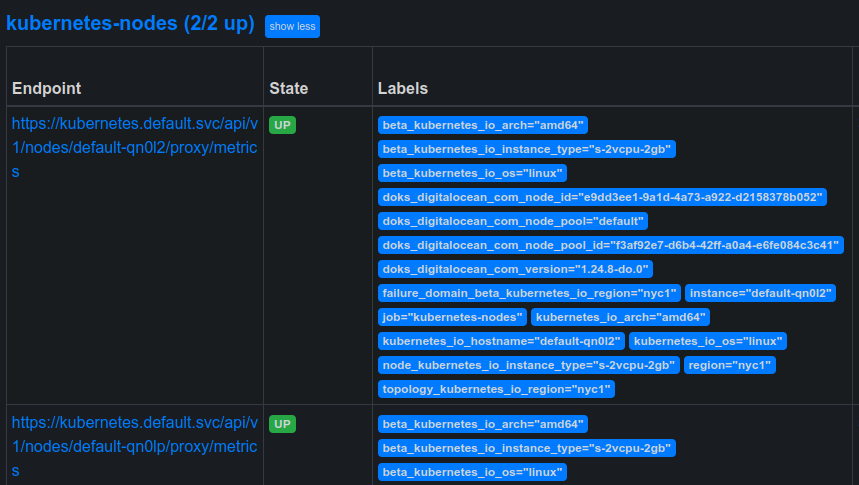

> [EDIT]: Imagem errada, era pra ser a do kubernetes-nodes, como essa estava com 2/2 eu tirei o print errado

Em `kubernetes-pods` vemos que ele só tá monitorando 2 pods o `cilium` do kubernetes e não tá monitorando mas nada. Não teria o `Service Discovery` pra ele monitorar a aplicação e tals? O que acontece é que eu preciso sinalizar para o Prometheus que ele precisa monitorar os pods, isso pode ser feito usando `annotations`. 

Primeiramente vamos testar localmente antes de aplicar para o Jenkins.

Em `deployment.yaml`, troquei o `{{TAG}}` para uma versão que existe no meu DockerHub, e além disso, no metadata do pod (que está dentro do template) será adiconado o seguinte trecho:

```yaml
  template:
    metadata:
      labels:
        app: web
      annotations:
        prometheus.io/scrape: "true"
        prometheus.io/port: "8080"
        prometheus.io/path: "/metrics"
```

Dessa forma eu marco que meus Pods serão monitorados. As métricas que serão coletadas já estão disponívels na aplicação, pois a aplicação foi feita pensando em fornecer essas métricas:

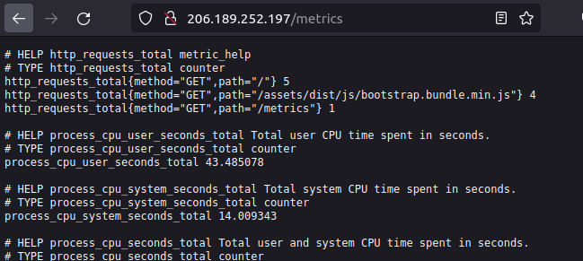

E assim, executa-se o comando:
```bash
❯ kubectl apply -f kube-news/k8s/deployment.yaml
deployment.apps/postgres unchanged
service/postgres unchanged
deployment.apps/web configured
service/web unchanged
```

Após de um tempo, qnd os Pods começarem a rodar, eles já podem ser monitorados pelo Prometheus

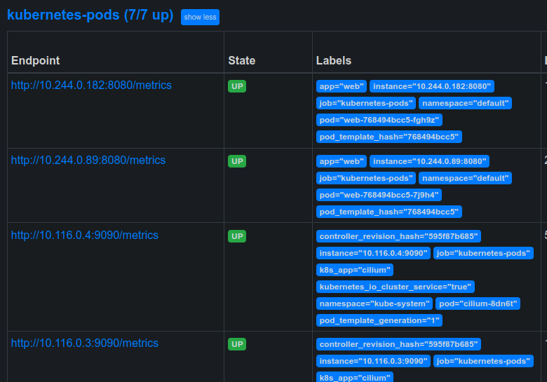

Então dessa forma, você indica para o Prometheus que ele precisa coletar as métricas dessa aplicação.

Agora voltei a versão pinada no Dockerfile para `{{TAG}}` no arquivo `deployment.yaml` e vou fazer o **commit** dessa alteração para o Jenkins poder ver.

O Jenkins deployou a aplicação corretamente e vamos ver se ele tá pegando as métricas no Prometheus

Para isso vá em `Graph`.

A primeira foi `http_requests_total`, ela foi vista em `/metrics` da aplicação.

### Entendendo o PromQL

O PromQL funciona da seguinte forma: você seleciona uma métrica em que você quer consultar.

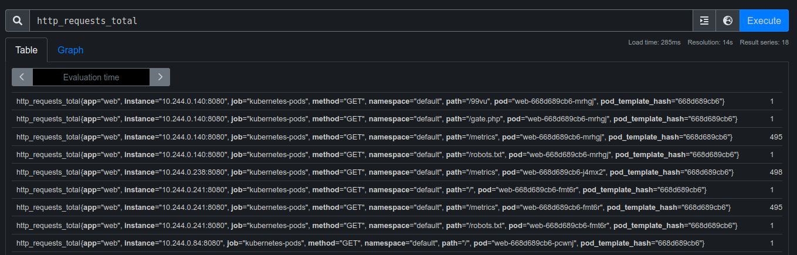

A partir disso você vai ter uma série de informações sobre diferentes endpoints, instâncias, aplicações...

Você pode também colocar o momento de avaliação desta query neste input:

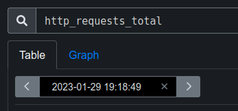

Uma outra coisa que você pode fazer é visualizar esses dados em gráficos:

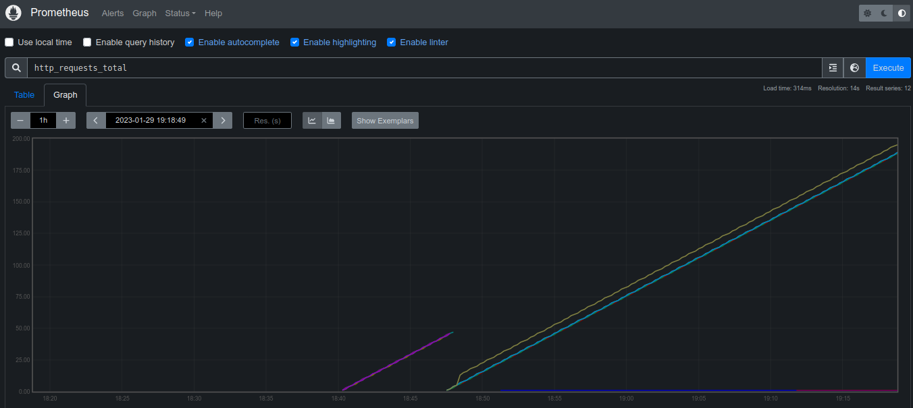

Além disso é possível fazer filtros para ver dados mais específicos. Para saber por exemplo as métricas referentes aos `http_requests_total` só do `path` raíz `path="/"`, é só fazer na Query:

```promql
http_requests_total{path="/"}
```

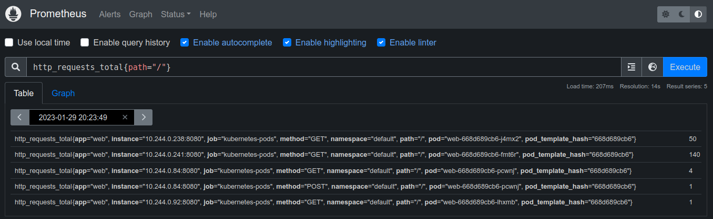

Você pode colocar também o "não igual"

```promql
http_requests_total{path!="/"}
```

Exemplos:

```promql
http_requests_total{path!="/metrics"}
```

Você pode tamber usar expressão regular, como no exemplo abaixo, vamos pegar requisições no css e no js:

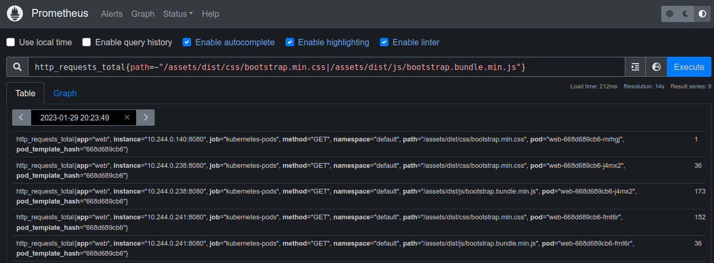

A consulta retorna um valor atual. Mas eu posso querer pegar o valor de um range de tempo, as métricas relacionadas a um intervalo de tempo. Para isso utiliza-se o range vector.

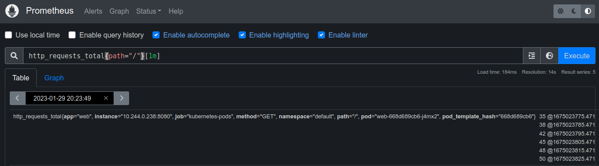

Foram retornados agora 6 valores, referentes ao último minuto de métricas, com 10 segundos de intervalo. Este valor é o `scrap_interval` que foi definido como `10s`.

A visualização em gráfico não é possível para um `range vector`:

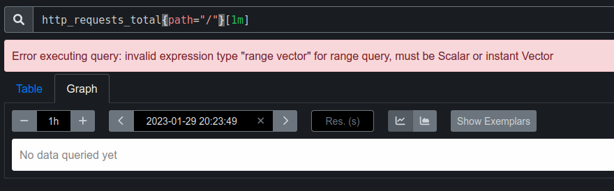

Mas para isso podemos usar algumas funções do Prometheus, uma delas é a média.

```promql
rate(http_requests_total{path="/"}[1m])
```

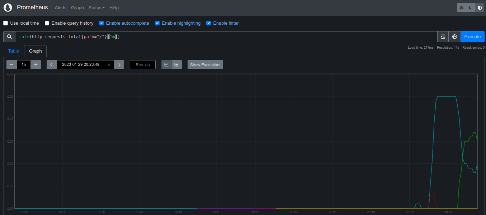

Se e quiser agora a média de todas as execuções eu posso usar uma função agregadora da seguinte forma:

```promql
sum(rate(http_requests_total{path="/"}[1m])) by (app)
```

Enfim, o básico sobre consultar métricas é isso, mas para visualizar os dados de forma melhor usaremos o Grafana

### Grafana

Agora para exibir esses dados no Grafana:

```bash
❯ kubectl get svc
NAME                            TYPE           CLUSTER-IP       EXTERNAL-IP       PORT(S)        AGE
grafana                         LoadBalancer   10.245.119.142   <pending>         80:31724/TCP   4h37m
kubernetes                      ClusterIP      10.245.0.1       <none>            443/TCP        4h50m
postgres                        ClusterIP      10.245.175.252   <none>            5432/TCP       4h41m
prometheus-kube-state-metrics   ClusterIP      10.245.58.230    <none>            8080/TCP       4h37m
prometheus-node-exporter        ClusterIP      10.245.93.116    <none>            9100/TCP       4h37m
prometheus-server               LoadBalancer   10.245.175.31    167.172.1.151     80:31493/TCP   4h37m
web                             LoadBalancer   10.245.97.241    206.189.252.197   80:30728/TCP   4h41m
```

O IP do Grafana não está disponível por que a Digital Ocean limitou a conta free para 2 LoadBalancer, mas em um outro terminal, um `port-forward` pode ser feito para o `localhost:8081` como mostra abaixo:

```bash
❯ kubectl port-forward service/grafana 8081:80
Forwarding from 127.0.0.1:8081 -> 3000
Forwarding from [::1]:8081 -> 3000
```

Um portal de login será exibido. O `username` é `admin`. Para saber a senha, basta rodar o seguinte comando:

```bash
❯ kubectl get secret grafana -o jsonpath="{.data.admin-password}" | base64 --decode ; echo
zRRamylUGOfkG3RymZiGMxycbCIuaa0pP0WeTUf4
```

E após entrar no Grafana uma tela como essa será exibida:

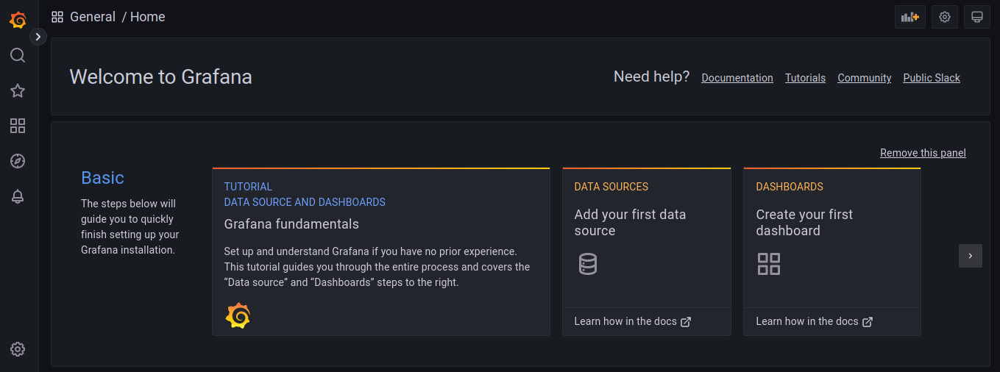

Primeira coisa é setar um datasource 

`Configuration > Data sources > Add data source > Prometheus`

- URL: `http://prometheus-server`

Clique em save and test

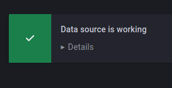

Agora vá em `Dashboards > New dashboard > Add a panel`

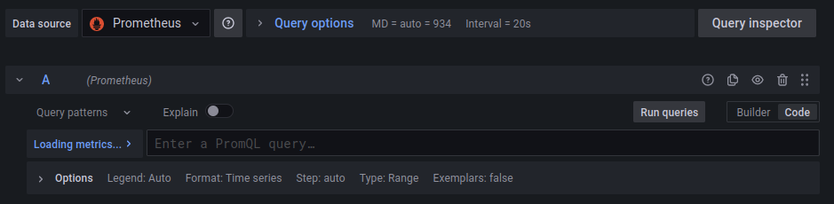

Nesta parte da tela, selecione a opção `Code` para inserir os comandos PromQL

Quando for adicionado uma Query, você verá ele na tela desta maneira:

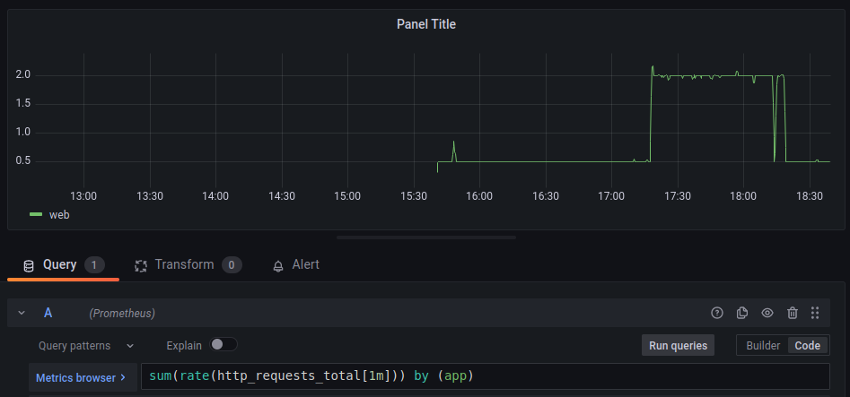

Agrupando por path ao invés de app você verá algo assim:

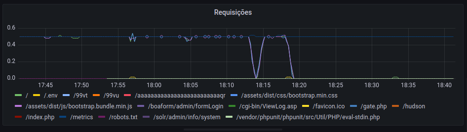

Em https://grafana.com/grafana/dashboards/ temos vários dashboards que a própria comunidade constrói, pesquisando por um dashboard de nodejs encontramos uma qualquer...

Cada dashboard tem uma ID, você pode copiar a ID desse dashboard, importar dentro do Grafana em, neste exemplo foi importado com o ID = `11159`

No Grafana, vá em `Dashboards > Import` e cole a ID desejada e `Prometheus` como datasource. Após cliar em Import um dashboard pronto será visto como o abaixo:

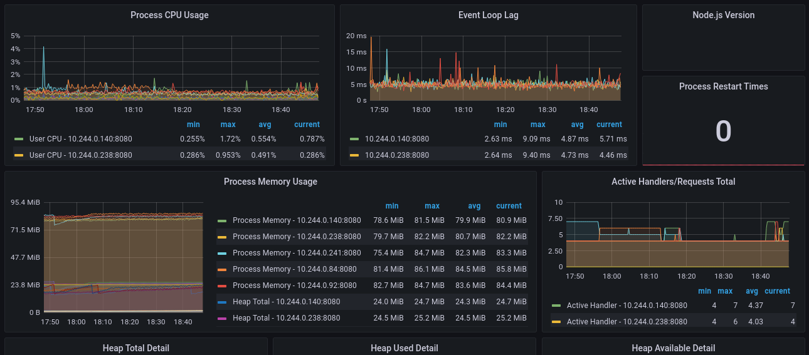

Com isso chegamos ao fim da semana dev ops ❤️