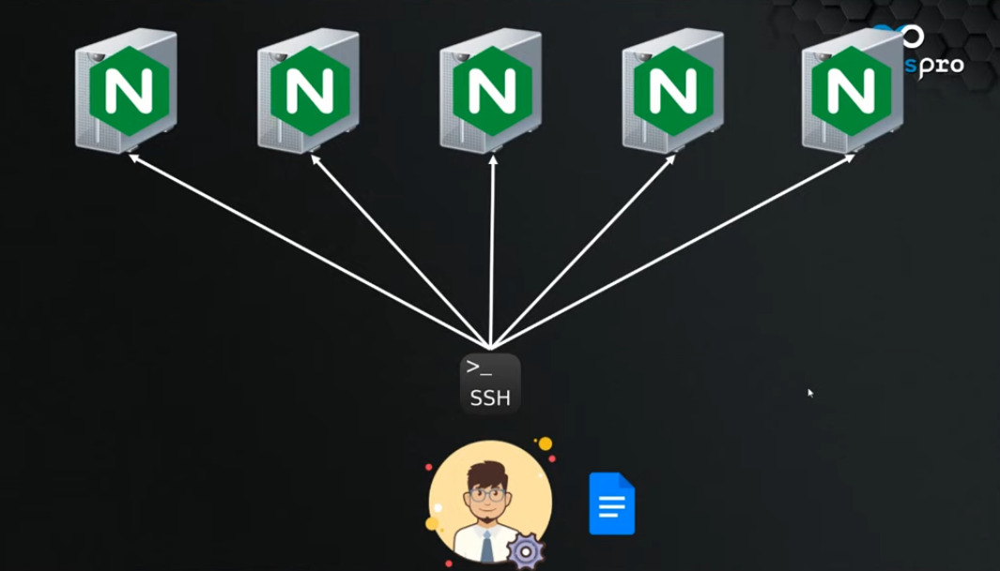
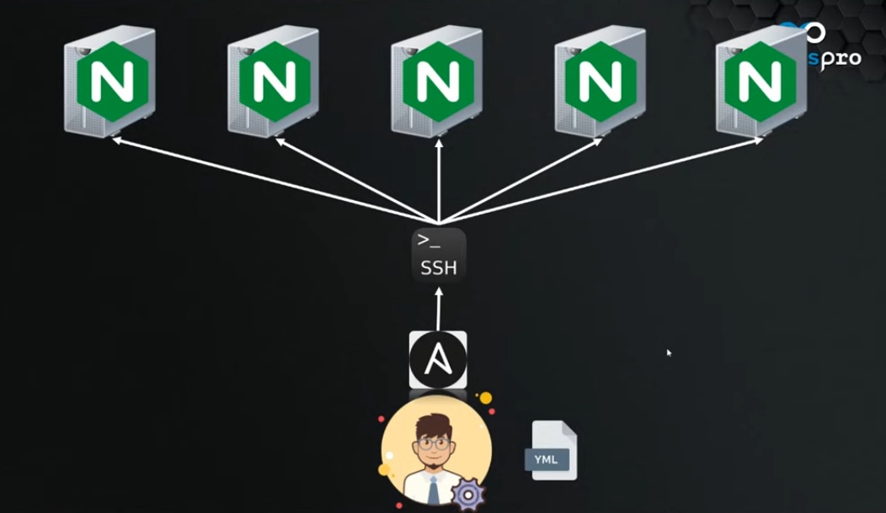
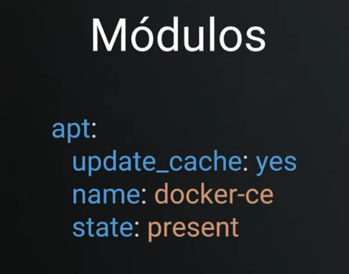
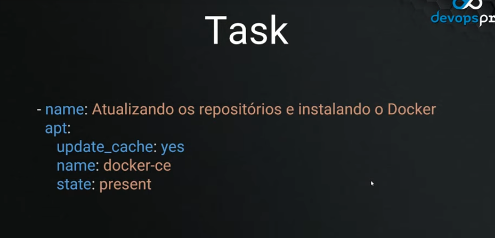
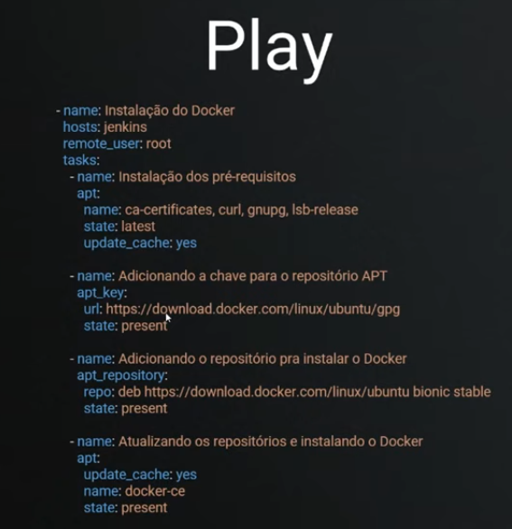
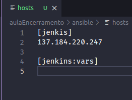
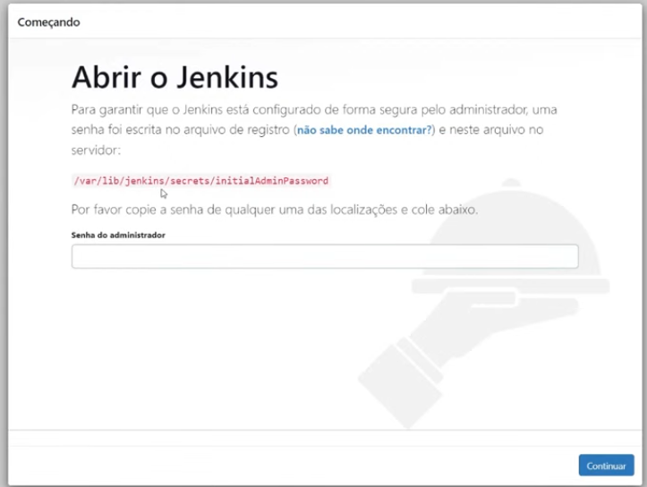

# Aula da live de encerramento

Primeiramente, a infra foi provisionada com `terraform apply`

Para configurar as máquinas via ssg como por exemplo varios nginx, seria um trabalho muito trabalhoso



Para isso serve o ansible, ele é uma ferramente que permite você fazer a configuração dessas máquinas. Ele pega toda a especificação que você determinou e vai aplicar utilizando o ssh, mas a diferença é que você vai criar um arquivo especificando toda a configuração e quando aplicar isso vai ser realizado automático.



Alguns conceitos são importantes para se trabalhar com o Ansible




O módulo é uma configuração que será aplicada na máquina, existem vários tipos de módulo para diversas funções.

Depois do módulo, temos a task, ela é uma tarefa



Um conjunto de tarefas é o que chamamos de Play



Um conjunto de plays é formado um Playbook

Além disso temos outro cara importantíssimo que é o inventário


Ele diz quais as máquinas, quais hosts, de máquinas eu vou ter no meu playbook além de configurações.

Para saber as opções das tarefas em que eu vou executar basicamente você pode usar a documentação do Ansible e procurar por `Ansible collections`.

Voltando para o terminal, temos:

```bash
Outputs:

jenkins_ip = "137.184.220.247"
❯ cp ./kube_config.yaml ~/.kube/config
```

Agora vou criar o diretório ansible:

```bash
❯ cd ..
❯ mkdir ansible
❯ cd ansible
```

O primeiro passo é criar o meu arquivo de inventário `hosts`



Agora a chave ssh será adicionada dessa forma:
```ansible
[jenkis]
137.184.220.247

[jenkins:vars]
ansible_ssh_private_key_file=~/.ssh/terraform-digitalocean
ansible_user = root
```

Agora vamos fazer o playbook:

```yaml
- name: Instalação Java
  hosts: jenkins
  remote_user: root
  tasks:
    - name: Instalando o Java
      ansible.builtin.apt:
        name: openjdk-11-jdk
        state: present
        update_cache: yes
```

Após isso execute `ansible-playbook -i hosts playbook.yaml`

> Mostrar que deu bom

Agora vamos fazer a instalação do Jenkins, deve ser adicionado o seguinte trecho:

```yaml
- name: Instalação Jenkins
  hosts: jenkins
  remote_user: root
  tasks:
    - name: Adicionando a chave do repositório
      ansible.builtin.apt_key:
        url: https://pkg.jenkins.io/debian-stable/jenkins.io.key
        state: present

    - name: Adicionando o repositório
      ansible.builtin.apt_repository:
        repo: "deb https://pkg.jenkins.io/debian binary/"
        state: present

    - name: Instalando o Jenkins
      ansible.builtin.apt:
        name: jenkins
        state: present
        update_cache: yes
```

Após executar `ansible-playbook -i hosts playbook.yaml`, vemos que funcionou direitinho.

> Mostrar saída aqui



Para pegar o token é possivel colocar mais uma task no ansible:

```yaml
    - name: Obtendo a chave
      ansible.builtin.command: cat /var/lib/jenkins/secrets/initialAdminPassword
      register: chave

    - name: Exibir a chave do jenkins
      ansible.builtin.debug:
        msg: "{chave.stdout}}" 
```

> Mostrar ele retornando aqui a chave

